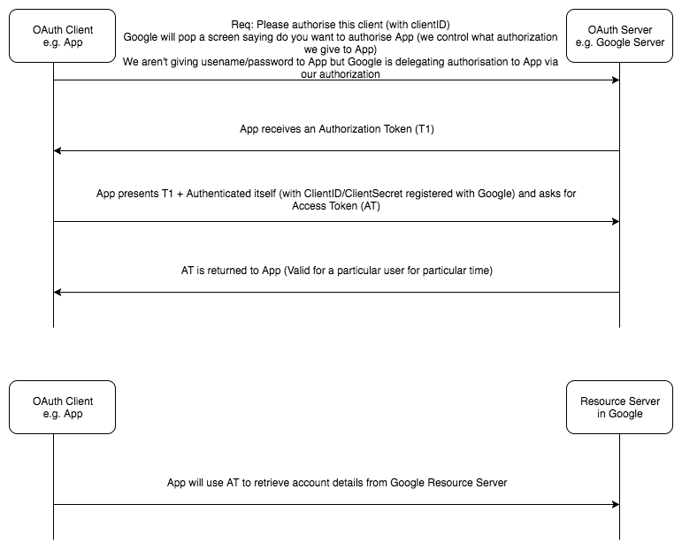

## What is OAuth2

- OAuth is open standard for access deligation.
- It provides clients a "secure delegated access" to resource server on behalf of resource owner
  - Basically we don't give username/password to app but authorize it to use our information (by deligation)
- Its not an Authentication Protocol but its an Authorization Standard (more of a framework)
- Components
  - Authorization Server
  - Resource Server
- OAuth2 has different implementations e.g. Facebook and Google have different implementations

## Flow Diagram

{:title="OAuth 2 Message Flow"}

## Reference
- [What is OAuth2? How does OAuth2 work? | Tech Primers](https://www.youtube.com/watch?v=bzGKgC3N7SY){:target="_blank" rel="nofollow" rel="noopener"}
