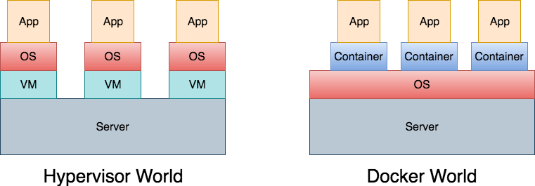

**Docker**{: .firstword} is technically,
> An implementation of Container Technology.

<br/>

Did I just explained one term (Docker) with another term (Container). Well, Lets take a step back and understand that one liner.

<br/>

First things first, 

## Let's dig into Containers in Docker
To understand Container Technology, lets discuss how we used to deploy application on a hardware.  
Traditionally we used to,
- Procure a hardware
- Install a hypervisor
- Create Logical separations/partition of hardware resources e.g. CPU, memory etc to create secure, isolated runtime environment
- Deploy Application on a partition

<br/>

In above approach we need to install OS on each hypervisor partition which has following drawbacks,
- It consumes a lot of memory of underlying hardware.
- OS needs periodic patching/maintenance in all partitions.
- We need to procure license (for windows os etc.) for all partitions.

<br/>

Also, We can't afford to install 2-3 apps on a single partition 
- As bad code (resource/memory leak) in one App will bring down all the apps on that partition.
- We may need different version(s) of same librarie(s) for different apps.

<br/>

**Can we deploy Apps on same OS maintaining Isolated Runtime between them?**  

<br/>

Here Container Technology comes to rescue,
> Container runs on a thin virtualization on top of Operating System

<br/>

To understand above definition lets compare it with VM or hypervisor. 
> VM or hypervisor grabs physical resources like CPU, RAM, storage, networks etc and slices them into virtual versions i.e. virtual CPU, virtual RAM, virtual NICs etc and then builds virtual machines out of them, which feels like normal physical servers.

<br/>

**Container Engines** on the contrary, slice operating system resources instead of slicing physical server resources e.g. process namespace, the network stack, storage stack, file system hierarchy etc. 

## Docker Container Vs VM (Hypervisor)

{:title="Comparison of Hypervisor with Docker"}

Summarizing above,
> Container act as multiple isolated instances of user spaces on OS sharing a single common kernel

<br/>

Containers are implemented using two components, viz
- **Linux Namespaces**{: .heading1}
- **cgroups**{: .heading1}

### Linux Namespaces

Linux Namespaces lets us virtualize system resources e.g. filesystem, networking etc.  
In effect, every container gets its own,
- Process tree (i.e. PID 0, PID 1...). 
  - Implying a process inside of one container cannot send a signal to a process inside of another container. 
- Network stack i.e. it's own IP addresses, port range, routing table.
- Root filesystem i.e. '/' on Linux and 'C:/' on Windows

### cgroups

- cgroups helps to limit amount of resources e.g. CPU, memory etc that each container can use.
- We map containers to cgroups in a 1:1 mapping

<br/>

**Container Runtime** is responsible for setting up namespaces and cgroups for containers and then running command inside those namespace and cgroups.

<br/>

**Characteristics of Containers**{: .heading1}  
- Its an abstraction at app layer packaging code and dependencies together.
- Multiple Containers share same OS Kernel
- Each container runs in an isolated process in user space.
- App packed into container consumes less space than deploying App on hypervisor partition

<br/>

Enough of containers lets get back to its implementation...

## What is Docker
> Docker provides a uniform and standard runtime environment where the functionality of an app packed into container remains unchanged whether its running on developers laptop or datacenter or a cloud provider e.g. AWS or Azure.  
Internally it uses **libcontainers** (a pure Go library) as its underlying execution driver (replacing historic LXC driver)

## Jargons of Docker World

### Docker Inc.

Docker Inc. is the company behind development of docker.

### Docker Engine

Docker engine/Docker daemon is a standardized runtime environment, that looks and feels the same no matter what platform it's running on making application portability super simple.

### Docker Image And Docker Container

The relation between image and container resembles the relation between program and process i.e.
> Container is running instance of Image.

<br/>

- Docker Image contains all the data and metadata required to fire up a container.
- Images are build time constructs while containers are runtime constructs.

<br/>

**Image in Docker has a concept of Layers, briefly**{: .heading1}  
- Image layering is a technique by which we can enhance functionality of an already existing image.
- It is accomplished through union mounts i.e. ability to mount multiple file systems on top of each other. 
  - In case of conflict higher layer wins.
- All layers in image is mounted as read only
- When container is launched,
  - An additional layer is added at top which is the only **writable layer**

### Docker Volumes
- To persist data outside containers ```Union file System``` into Docker host we can mount a volume from dockerhost into container.
- Essentially it decouples data from the container. So if a container stops or is deleted the data persists.
- Volume can also be shared among multiple containers.

### Docker Registries / Docker Hub
- Docker Registries is like an online marketplace to store and retrieve container images
- [Docker hub](https://hub.docker.com/) is the big one but we can host private repositories as well.
- Inside registries, we can have multiple repositories.

## Docker Download/Install
Installing Docker on dev box is super easy, 
- Follow [this](https://docs.docker.com/docker-for-mac/install/){:target="_blank" rel="nofollow" rel="noopener"} page for MAC Install
- Follow [this](https://docs.docker.com/docker-for-windows/install/){:target="_blank" rel="nofollow" rel="noopener"} page for Windows Install

## How to use Docker
Once we have installed docker on our favorite dev box (mine being MAC). We can test the installation by,  

``` docker run hello-world ```

<br/>

Above command produce following output,  

```
Unable to find image 'hello-world:latest' locally
latest: Pulling from library/hello-world
d1725b59e92d: Pull complete 
Digest: sha256:0add3ace90ecb4adbf7777e9aace...
Status: Downloaded newer image for hello-world:latest

Hello from Docker!
This message shows that your installation appears to be working correctly.

To generate this message, Docker took the following steps:
 1. The Docker client contacted the Docker daemon.
 2. The Docker daemon pulled the "hello-world" image from the Docker Hub.
    (amd64)
 3. The Docker daemon created a new container from that image which runs the
    executable that produces the output you are currently reading.
 4. The Docker daemon streamed that output to the Docker client, which sent it
    to your terminal.

To try something more ambitious, you can run an Ubuntu container with:
 $ docker run -it ubuntu bash

Share images, automate workflows, and more with a free Docker ID:
 https://hub.docker.com/

For more examples and ideas, visit:
 https://docs.docker.com/get-started/
```

<br/>

Above Console output gives a lot of details. I would like to highlight few among them, lets begin with understanding

### Docker Client Server

Standard Docker install gives us client and daemon on the same host. It's running the Docker client and the Docker daemon. We'll often hear that combo referred to as the Docker Engine, sometimes Docker Engine might just refer to daemon part.

<br/>

When we issue docker run command:
- Client component interprets that command and made API calls to the daemon. 
- Docker daemon implements the Docker remote API (sometimes you might hear Docker Engine API. Either way, it's a client/server model)
- Docker run starts a new container and we had to specify the image that we want to use as the template for the container. (e.g. hello-world image)
- Daemon checks its local store to see if it already had a copy of it. If it did not find image, it will search for it on Docker Hub. (Docker image registry which is the default registry that the daemon uses) and pull it locally. As we can see in following logs,

```
Unable to find image 'hello-world:latest' locally
latest: Pulling from library/hello-world
```

- Once the image is pulled locally, the daemon will do the heavy lifting needed to create and spin up a brand new container (based on configuration inside of the hello-world image)

<br/>

That all folks !!  
The intention of this article is to act as brief docker wiki. We tried to touch all the major areas related to docker technology in this brief docker tutorial.


## Reference
- [Nigel Poulton - Courses on Docker](https://www.pluralsight.com/authors/nigel-poulton){:target="_blank" rel="nofollow" rel="noopener"}
- [Blog.docker.com](https://blog.docker.com/2014/03/docker-0-9-introducing-execution-drivers-and-libcontainer/){:target="_blank" rel="nofollow" rel="noopener"}
- [Ian Lewis container-runtimes](https://www.ianlewis.org/en/container-runtimes-part-1-introduction-container-r)
- [Docker.com](https://www.docker.com/resources/what-container)
