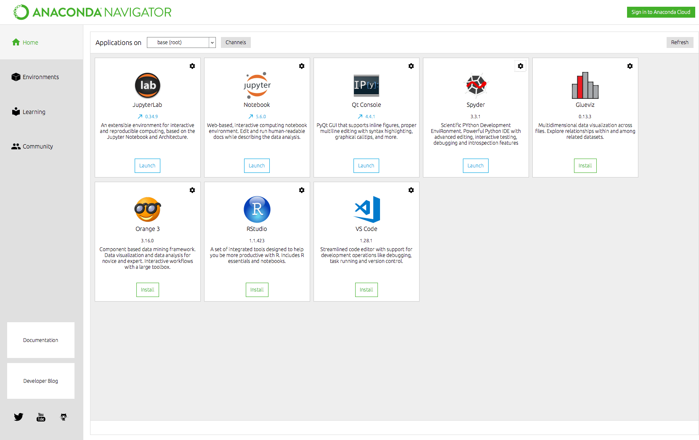
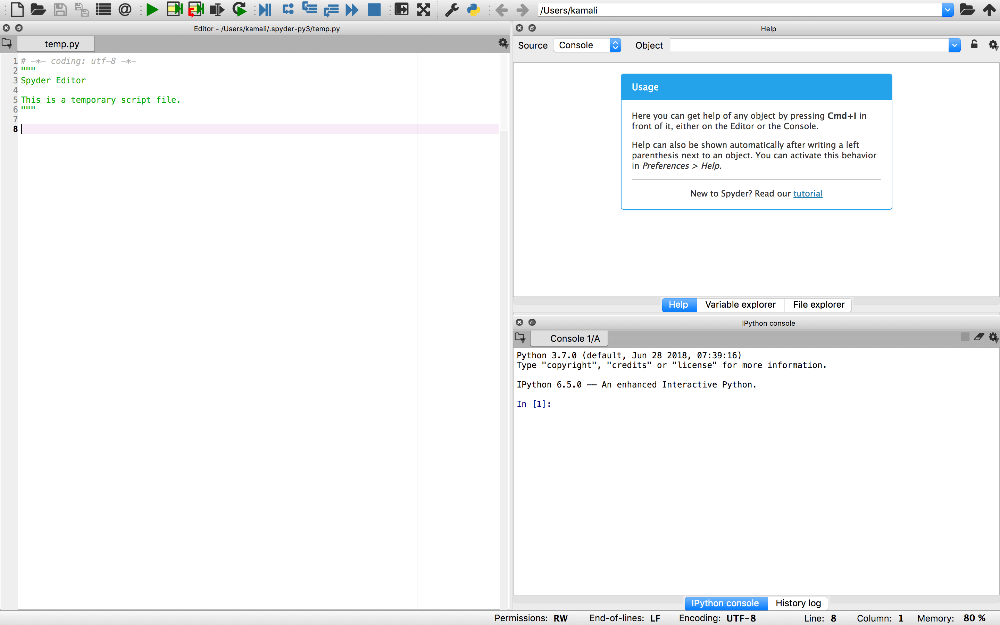
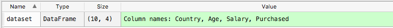

**Machine Learning**{: .firstword} a term coined by Arthur Samuel in 1959, is a branch of Artificial Intelligence in which computer systems are given ability to learn from data and make predictions without being programmed explicitly or any need of human intervention.

<br/>

In simple words, Machine Learning is a science to device models on  data which is then used by data scientist, research engineers etc. to make predictions.

<br/>

Machine Learning can be applied in a variety of fields viz,
- Mail classification based on user interaction with his mailbox 
- Facial Recognition
- Speech to Text
- Voice Recognition
- Recommendation System of Amazon

<br/>

The purpose of this Machine Learning tutorial is to provide a brief machine learning introduction and equip the readers with basic machine learning tools. We will use Python as programming language to process data and build models.

<br/>

But before moving any further let's ponder over

## Why we need Machine Learning
We need machine learning in computing tasks where designing and programming algorithms based on static program instructions are infeasible if not impossible.   

<br/>

Classical example of such task will be **Email Filtering**. Each individual has its own ways of classifying emails as trash or important (there can be other categories also). So an App having hard coded filters will not work for all the individuals. 

<br/>

A good app/software should learn from how a user is interacting with his inbox and then assist him in classifying future mails. 

<br/>

**Sounds interesting !!!**

<br/>

Let's quickly look into 
 
## How machine learning Solves it
A machine learning algorithm will learn from the user behaviour and dynamically help him in classifying future emails in appropriate categories.

<br/>

Moving on !!!

<br/>

Based on data being fed to a machine learning model, we have following

## 4 Classification of Machine Learning
1. **Supervised Machine Learning**{: .heading1}
In this method computer is given complete and labeled training set of inputs and desired outputs. Computer then derives a corelation between input and output to make predictions. There is a complete list of supervised learning algorithms which is outside the scope of this tutorial.

2. **Semi-supervised Machine Learning**{: .heading1}
In this method computer is given incomplete training set of inputs where outputs are missing for few (sometimes most) records.

3. **Unsupervised Machine Learning**{: .heading1}
In this method computer is given incomplete and unlabeled training set of inputs. Computer is left on it's own to find structure in that data.

4. **Reinforcement Machine Learning**{: .heading1}
In this method computer is given feedback for his predictions which is either reward points or punishment. This feedback is helpful to improve the accuracy of future predictions made by machine learning model.

<br/>

I guess that's enough of theory let's quickly look into building a machine learning model. But before that we need to install basic tools/softwares. Starting with,

<br/>

### Installing Anaconda
Anaconda comes with a bundle of useful tools. It installs Python (I'm using Python 3), IDE's for Python e.g. spyder, useful packages like numpy, pandas etc that we will use for Machine Learning and what not.

<br/>

You can use [this](https://www.anaconda.com/distribution/){:target="_blank" rel="nofollow" rel="noopener"} link to install Anaconda

<br/>

After installing, Type for *Anaconda Navigator* to start it.

<br/>

It looks like the following,
{:title="Anaconda Navigator"}

<br/>

After we are done installing basic tools, lets launch *Spyder* from Anaconda Navigator,  
This is how it looks like in *default Layout*

<br/>

{:title="Spyder"}

<br/>

**Tips**
- You can select the ```Spyder Default Layout``` from ```View > Windows layout```
- To customise Edior, Go ```Preferences > Editor```
- If any of the pane is missing from it, You can add it from ```view > panes```

<br/>

This is what I have for myself,
{:title="Spyder"}

<br/>

Let's test everything by running a basic print command,
- write ```print("Hello from Spyder")``` in Test editor and save it.
- Run it by selecting the code and pressing ```Shift+Enter``` (in mac)
- You can see ```Hello from Spyder``` in IPython Console

<br/>

Moving On ...

<br/>

Lets learn the basics of how to load, process data before fitting it into a machine learning model.

<br/>

The data looks something like this,

```py
Country	Age	Salary	Purchased
France	44	72000	No
Spain	27	48000	Yes
Germany	30	54000	No
Spain	38	61000	No
Germany	40		    Yes
France	35	58000	Yes
Spain		52000	No
France	48	79000	Yes
Germany	50	83000	No
France	37	67000	Yes
```
**Data Credits**{: .exception} All the data used in this tutorial is take from [**Superdatascience**](https://www.superdatascience.com/machine-learning/ ){:target="_blank" rel="nofollow" rel="noopener"} data set

<br/>

In above data,
- ```Country, Age and Salary``` are the details of the customer. They are called **Independent Variables** because predictions will be made by analysing them.
- ```Purchased``` tells us wheather the customer bought the product of the company. This is **Dependent Variable** or **Predicted output**

<br/>

> In Machine Learning models, we use **independent variables** to predict **dependent variables**

<br/>

So, using ```Country, Age and Salary``` we are going to predict wheather the customer bought the product of the company.

<br/>

Once we have the data in hand, we will now process it step by step. Beginning with,  
**Step 1:** Importing the Libraries

```py
import numpy as np # Contains mathematical tools
import matplotlib.pyplot as plt # Tools for plotting Charts
import pandas as pd # Helps in importing data sets and managing data sets
```
To load libraries, Select the code & Execute it (Shift + Enter for MAC)

<br/>

**Step 2:** Importing the Data Sets
- First set the working directory. To do so, either you can put the code file in same directory of data file and execute it again (F5) Or you can choose the appropriate directory from ```file explorer```.

```py
dataset = pd.read_csv('Data.csv') # read_csv is a function from pandas which we have used to import data set. 
```

<br/>

In variable explorer you can see something like this,
{:title="Data Set"}

<br/>

**Step 3:** Segregate **Independent Variables** and **Dependent Variables**

```py
 X = dataset.iloc[:, :-1].values
 """
 In iloc, left of comma are line and (:) implies we are taking all the lines
 Right of comma are colums and (:-1) implies we are taking all the columns except last one
 """
 
  Y = dataset.iloc[:, 3].values
  # 3 is index for Purchased Column
```
Above code will create two variable X and Y.  
X will contain data of Independent Variables and Y will contain data for Dependent Variables.

<br/>

If we type X in IPython Console and press enter, we will see something like

```py
array([['France', 44.0, 72000.0],
       ['Spain', 27.0, 48000.0],
       ['Germany', 30.0, 54000.0],
       ['Spain', 38.0, 61000.0],
       ['Germany', 40.0, nan],
       ['France', 35.0, 58000.0],
       ['Spain', nan, 52000.0],
       ['France', 48.0, 79000.0],
       ['Germany', 50.0, 83000.0],
       ['France', 37.0, 67000.0]], dtype=object)
```

<br/>

In Y, we have

```py
array(['No', 'Yes', 'No', 'No', 'Yes', 'Yes', 'No', 'Yes', 'No', 'Yes'],
      dtype=object)
```

<br/>

**Step 4:** Fixing the missing data  
We have missing data in both Age and Salary Column. So we have two options,
- Removing rows with missing data.
  - If this row contains crucial information then it's dangerous to remove observation
- Replacing the missing data with mean of the column
  - This is most favourable approach.

<br/>

```py
# Fixing the missing data
from sklearn.preprocessing import Imputer # importing Imputer

imputer = Imputer(missing_values = 'NaN', strategy = 'mean', axis=0)
imputer = imputer.fit(X[:, 1:3]) 
"""
: => all the rows
1:3 => Age and Salary column, 3 is upper bound and is excluded
"""

X[:, 1:3] = imputer.transform(X[:, 1:3])
```

<br/>

After above code run,  
X variable looks like

```py
Out[4]: 
array([['France', 44.0, 72000.0],
       ['Spain', 27.0, 48000.0],
       ['Germany', 30.0, 54000.0],
       ['Spain', 38.0, 61000.0],
       ['Germany', 40.0, 63777.77777777778],
       ['France', 35.0, 58000.0],
       ['Spain', 38.77777777777778, 52000.0],
       ['France', 48.0, 79000.0],
       ['Germany', 50.0, 83000.0],
       ['France', 37.0, 67000.0]], dtype=object)
```

<br/>

**Step 5:** Encoding the categorical variables  
We have two categorical data in our dataset
- Country => France, Spain, Germany
- Purchased => Yes, No

<br/>

Since machine learning models are based on mathematical equations. So kepping text in categorical variable will create problems in the equations as we only want numbers in the equations.  

<br/>

So we need to encode the categoriacal variables into numbers.

Below code does exactly that

```py
# Encoding the categorical variables
from sklearn.preprocessing import LabelEncoder

labelencoder_X = LabelEncoder()
X[:, 0] = labelencoder_X.fit_transform(X[:, 0]) 

"""
0 is index of country column
fit_transform() will return the encoded version of country column
"""
```

<br/>

Above code assign encoding like,
- France => 0
- Spain => 1
- Germany => 2

<br/>

**Which is deeply problematic.**  

<br/>

Assigning 2 to Germany gives it more precedence over France and Spain which is so not the case. We need to make sure that encoding variables should not attribute an order into categorical variables.

<br/>

We can achieve it by creating three separate columns for Germany, France and Spain and use 1 Or 0 to denote that this row belongs to which category.  
Something like

<br/>

```py
France Germany Spain
1	0	0
0	0	1
0	1	0
0	0	1
0	1	0
1	0	0
0	0	1
1	0	0
0	1	0
1	0	0
```

<br/>

Below code does exactly that

```py
# Encoding the categorical variables
from sklearn.preprocessing import OneHotEncoder

onehotencoder = OneHotEncoder(categorical_features = [0])
X = onehotencoder.fit_transform(X).toarray()
```

<br/>

X looks like

```py
France Germany Spain Age	Salary
1	0	0	44	72000
0	0	1	27	48000
0	1	0	30	54000
0	0	1	38	61000
0	1	0	40	63777.8
1	0	0	35	58000
0	0	1	38.7778	52000
1	0	0	48	79000
0	1	0	50	83000
1	0	0	37	67000
```

<br/>

To encode Y we can still use LabelEncoder. As it is a dependent Variable and Machine learning model will know that it's a category and there is no order between the two

```py
labelencoder_Y = LabelEncoder()
Y = labelencoder_X.fit_transform(Y) 
```

<br/>

Y looks like

```py
Purchased
0
1
0
0
1
1
0
1
0
1

```
<br/>

**Step 6:** Splitting data set into Training set and Test set  
We want to create training set and test set from our data set to check the correctness and performance of our model.

>**Training set** is defined as data on which we build the machine learning model.

<br/>

> **Test set** is defined as data on which we test the performance of machine learning model.

<br/>

We build machine learning model on training set by establishing correlation between independent variable and dependent variable in train set.  

<br/>

Once our machine learning model understands the correlation between independent variable and dependent variable. We will test if the machine learning model can apply the correlations learned from training set on the test set i.e. we will check the accuracy or correctness of the predictions on test set.

<br/>

Below code does exactly that

```py
# splitting the dataset into Training set and Test set
from sklearn.model_selection import train_test_split
X_train, X_test, Y_train, Y_test = train_test_split(X, Y, test_size = 0.2, random_state = 0)

"""
.02 => we have 80% train set and 20% test set
"""
```

<br/>

Result form above code looks like,

<br/>

**X_train**

```py
France Germany Spain Age	Salary
0	1	0	40	63777.8
1	0	0	37	67000
0	0	1	27	48000
0	0	1	38.7778	52000
1	0	0	48	79000
0	0	1	38	61000
1	0	0	44	72000
1	0	0	35	58000
```

<br/>

**X_test**

```py
France Germany Spain Age	Salary
0	1	0	30	54000
0	1	0	50	83000
```
<br/>

Similarly we have 8 and 2 observations in Y_train, Y_test resprectively.

<br/>

**Step 6:** Variable Scaling  
Variables in Age and salary column contains numerical numbers which are not in same scale. We have age which goes from ``` 27 to 50 ``` and Salary from ```40k to 90k```

<br/>

A lot of machine learning models are based on ```Euclidean Distance```. The euclidean distance of *Salary* between two data points will dominate the euclidean distance of *Age* as the range of salary is much higher than Age.

<br/>

To mitigate this situation we need to bring them both in same scale / range for e.g. range of -1 to +1 etc.

<br/>

We can achive it by following methods
- Standardisation

```
X(stand) = (X - mean(X)) / standard deviation (X)
```
- Normalisation

```
X(norm) = (X - min(X)) / (max(X) - min(X))
```

<br/>

Below code does exactly that

```py
# Feature scaling
from sklearn.preprocessing import StandardScaler

sc_X = StandardScaler()
X_train = sc_X.fit_transform(X_train)
X_test = sc_X.transform(X_test) 
# we don't need to fit test set as it is already fitted for training set
```

<br/>

Result form above code looks like,
**X_train**

```py
France Germany       Spain                Age	           Salary
-1	 2.64575	 -0.774597	 0.263068	   0.123815
 1	-0.377964	-0.774597	-0.253501	   0.461756
-1	-0.377964	 1.29099	-1.9754	           -1.53093
-1	-0.377964	 1.29099	 0.0526135	  -1.11142
 1	-0.377964	 -0.774597	1.64059	           1.7203
-1	-0.377964	 1.29099	-0.0813118	   -0.167514
 1	-0.377964	-0.774597	0.951826	    0.986148
 1	-0.377964	-0.774597	-0.597881        -0.482149
```

<br/>

**X_test**

```py
France Germany Spain Age	Salary
-1	2.64575	-0.774597	-1.45883	-0.901663
-1	2.64575	-0.774597	1.98496	2.13981
```

<br/>

**NOTE:** 
- Feature scaling on X_test is same as Feature scaling on X_train because the object StandardScaler was fitted to X_train. So its important to fit the object to X_train first so that X_test and X_train are scaled on same basis.
- Dependent variable vector Y_train and Y_test is a categorical variable with value either 0 and 1. So we don't need feature scaling in this case. If dependent variable takes huge range of values then we need to apply feature scaling in dependent variable as well.

<br/>

**Full Code for Data Preprocessing**

```py
# Improting the libraries
import numpy as np
import matplotlib.pyplot as plt 
import pandas as pd 

# Importing dataset
dataset = pd.read_csv('Data.csv')

X = dataset.iloc[:, :-1].values 
Y = dataset.iloc[:, 3].values

# Fixing the missing data
from sklearn.preprocessing import Imputer

imputer = Imputer(missing_values = 'NaN', strategy = 'mean', axis=0)
imputer = imputer.fit(X[:, 1:3]) 
X[:, 1:3] = imputer.transform(X[:, 1:3])


# Encoding the categorical variables
from sklearn.preprocessing import LabelEncoder, OneHotEncoder
labelencoder_X = LabelEncoder()
X[:, 0] = labelencoder_X.fit_transform(X[:, 0]) 
onehotencoder = OneHotEncoder(categorical_features = [0])
X = onehotencoder.fit_transform(X).toarray()
labelencoder_Y = LabelEncoder()
Y = labelencoder_X.fit_transform(Y) 

# splitting the dataset into Training set and Test set
from sklearn.model_selection import train_test_split
X_train, X_test, Y_train, Y_test = train_test_split(X, Y, test_size = 0.2, random_state = 0)

# Feature scaling
from sklearn.preprocessing import StandardScaler

sc_X = StandardScaler()
X_train = sc_X.fit_transform(X_train)
X_test = sc_X.transform(X_test)
```
<br/>

Phew !! That's it !!!

<br/>

We have looked into all the data processing steps.

<br/>

One thing to note is we may not be doing all the steps on a available dataset. It highly depends on the format of data in deciding which all steps of processing is required before applying any machine learning algorithm.

<br/>

Let's move on in building models beginning with

## Regression model in Machine Learning
Regression model is used to predict real values like salary (dependent variable) with time (independent variable). There are multiple regression techniques,
- Simple Linear Regression
- Multiple Linear Regression
- Polynomial Regression
- Support Vector for Regression (SVR)

<br/>

A Simple Linear Regression Technique is basically following formula,  

$$y = b_{0} + b_{1} x_{1}$$ where,   
$$y$$ = Dependent Variable (something we are trying to explain)  
$$x_{1}$$ = Independent Variable  
$$b_{1}$$ = Coefficient which determines how a unit change in x1 will cause a change in y  
$$b_{0}$$ = constant

<br/>

Suppose we have a ```Salary vs Experience``` data and we want to predict ```Salary``` based on ```Experience```. Plotting the data it looks something like,

{:title="Simple Linear Regression"}

In our scenario regression equation looks like  
salary = $$b_{0}$$ + $$b_{1}$$*Experience, where  
$$b_{0}$$ = salary at zero experience  
$$b_{1}$$ = change in salary with increase in experience. Higher the b1 (slope) it will yield more salary with increase in experience

<br/>

We want to find best fit line that best fits the observations marked as (+).

<br/>

**How to find that best fit line?**

<br/>

{:title="Chart"}

In above diagram, let L1 be the line representing simple linear regression model. We have drawn green lines from the actual observation (+) to the model.

<br/>

**a1** = tell us where the person should be sitting according to the model in terms of salary i.e. model observation  
**a2** = Actual salary of the person  
**green line** = Difference between what he's actually earning and what he should earn according to model.

<br/>

To find best fitting line, we do the following  
- Squaring all the green lines i.e. ```(a1-a2)²```
- Summing up the squared green lines i.e. ```Σ(a1-a2)²```
- Best fit line is ``` min(Σ(a1-a2)²)```

<br/>

Let's quickly create a model based on data, which looks like

```py
YearsExperience Salary
1.5	        37731.0
1.1	        39343.0
2.2	        39891.0
2.0	        43525.0
1.3	        46205.0
3.2	        54445.0
4.0	        55794.0
2.9	        56642.0
4.0	        56957.0
4.1	        57081.0
3.7	        57189.0
3.0	        60150.0
4.5	        61111.0
3.9	        63218.0
3.2	        64445.0
5.1	        66029.0
4.9	        67938.0
5.9	        81363.0
5.3	        83088.0
6.8	        91738.0
6.0	        93940.0
7.1	        98273.0
7.9	        101302.0
9.0	        105582.0
8.7	        109431.0
9.6	        112635.0
8.2	        113812.0
9.5	        116969.0
10.5	    121872.0
10.3	    122391.0
```
<br/>

Click [here](https://github.com/kamranalinitb/machine-learning/blob/master/data/Part%202%20-%20Regression/Section%204%20-%20Simple%20Linear%20Regression/Salary_Data.csv){:target="_blank" rel="nofollow" rel="noopener"} to get Full data.  
**Data Credits**{: .exception} All the data used in this tutorial is take from [**Superdatascience**](https://www.superdatascience.com/machine-learning/ ){:target="_blank" rel="nofollow" rel="noopener"} data set

<br/>

Step 1: **Loading and processing the data**

```py
import numpy as np
import matplotlib.pyplot as plt
import pandas as pd

# Importing the dataset
dataset = pd.read_csv('Salary_Data.csv')
X = dataset.iloc[:, :-1].values # Independent Variable
y = dataset.iloc[:, 1].values # Dependent Variable

# Splitting the dataset into the Training set and Test set
from sklearn.model_selection import train_test_split
X_train, X_test, y_train, y_test = train_test_split(X, y, test_size = 1/3, random_state = 0)

# We don't need feature scaling because the LinearRegression library will take care of it
```

<br/>

Step 2: **Fitting Simple Linear Regression to training data**

```py
# Fitting Simple Linear Regression to the Training set
from sklearn.linear_model import LinearRegression
linearRegressor = LinearRegression() # creating linearRegressor object
linearRegressor.fit(X_train, y_train) # Fitting model with training set
```

<br/>

Next step is to check how our Simple Linear Regression machine learned the corelation in a training by looking into predictions on test set observations

<br/>

Step 3: **Creating a Vector of Predicted Values**

```py
# Predicting the Test set results
prediction = linearRegressor.predict(X_test)
```
<br/>

Finally lets plot the predictions of linear regression model w.r.t. real observations.

<br/>

Step 4: **Visualization of Model w.r.t. training set**

```py
plt.scatter(X_train, y_train, color = 'red')
plt.plot(X_train, linearRegressor.predict(X_train), color = 'blue')
# Y coordinate is the prediction of train set
plt.title('Salary vs Experience (Training set)')
plt.xlabel('Experience')
plt.ylabel('Salary')
plt.show()
```

<br/>

It looks something like
{:title="Training Sets"}

<br/>

In above graph, real values are red dots and predicted values are in blue simple linear regression line

<br/>

Step 5: **Visualization of Model w.r.t. test set**

```py
plt.scatter(X_test, y_test, color = 'red')
plt.plot(X_train, linearRegressor.predict(X_train), color = 'blue')
# We will obtain same linear regression line by plotting it with either train set or test set
plt.title('Salary vs Experience (Test set)')
plt.xlabel('Experience')
plt.ylabel('Salary')
plt.show()
```
<br/>

It looks something like
{:title="Test Set"}

<br/>

In above graph, red dots are observations of test set and predicted values are in blue simple linear regression line.

<br/>

That's all folks, we have now build our very first machine learning model and made same decent predictions.

<br/>

## Conclusion
I would like to conclude this artice by highlighting the fact that Machine Learning is truely opening new prospects from petabytes of data that organisations have piled up.  

<br/>

One fine example would be Amazon Recommendation system. [This](https://www.forbes.com/sites/louiscolumbus/2017/10/23/machine-learnings-greatest-potential-is-driving-revenue-in-the-enterprise/){:target="_blank" rel="nofollow" rel="noopener"} article published on Forbes beautifully highlights the potential of Machine Learning  in driving revenue in the enterprise.

## Reference
- [Machine learning Wiki](https://en.wikipedia.org/wiki/Machine_learning){:target="_blank" rel="nofollow" rel="noopener"}
- [Machine Learning A-Z™: Hands-On Python & R In Data Science](https://www.udemy.com/machinelearning/){:target="_blank" rel="nofollow" rel="noopener"}

<!-- Data Set: [here](https://www.superdatascience.com/machine-learning/ ){:target="_blank" rel="nofollow" rel="noopener"} -->
