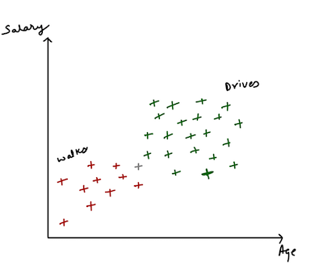

**Machine Learning**{: .firstword} is a branch of Artificial Intelligence in which computer systems are given the ability to learn from data and make predictions without being programmed explicitly or any need for human intervention.

<br/>

I've discussed Machine Learning deeply in [this](/machine-learning){:target="_blank"} post and regression in [this](/regression-in-machine-learning){:target="_blank"} post. 

<br/>

In this post, I would like to brush over common Machine Learning Classification Techniques. However, first, let's answer

## What is Classification problem in Machine Learning
In classification, we predict a category of a data point, unlike regression where we predict real constant values. 

<br/>

There are multiple classification techniques, but in this article, we will look into the following techniques viz,
- Logistic Regression
- K-Nearest Neighbors (K_NN) Classification
- Support Vector Machine Classification
- Kernel SVM Classification
- Naive Bayes Classification
- Decision Tree Classification
- Random Forest Classification

<br/>

Let’s look into each one of them individually beginning with

## Logistic Regression in Machine Learning
Logistic Regression is a linear classifier build on following formula,

<br/>

$$\ln\left(\frac{p}{1-p}\right) \ =\ b_{0} \ +\ b_{1} \ast x$$

<br/>

Above equation is the output of applying Sigmoid function in Linear Equation (Details of which is outside the scope of this tutorial)

<br/>

Let's understand this concept intuitively by taking an example.  

<br/>

Suppose we have `Age` vs. `Action` data and we want to predict whether an intended action (e.g., clicking on mail), is performed by a customer of a particular age

<br/>

Plotting the data it looks something like,

{:title="Logistic Regression Data"}

<br/>

Based on the age we want to predict the **probability** or **likelihood**, whether a person will click on mail (action) or not. 

<br/>

Applying logistic regression formula to the above data, we get a curve which looks like

{:title="Logistic Regression in Machine Learning"}

<br/>

The Green curve is the **best fitting line** from the logistic regression equation which best fits the data set. We can use that line to predict the probability for a particular age.

<br/>

Lets try predicting the probabilies of x=20,30,40,50 

{:title="Logistic Regression Sample"}

<br/>

Based on projection of x=20,30,40,50 we get probabilities as .07, .2, .85, .9 simultaneously. 

<br/>

To convert those probabilities to predictions, let's choose a threshold of .5 (i.e., 50%). So the probability of
- Below 0.5 is considered as it's not going to click on mail.
- Above 0.5 is considered as its likely going to click on the mail

<br/>

Based on the above threshold x=20,30 will not click on email and x=40,50 will click on email. We tried to predict the *likeliness* of a user to click on a mail.

<br/>

To further dive into Logistic Regression let's create a model, Where we would be predicting the whether a person will buy a particular product (e.g., a newly launched SUV Car) based on Age and Estimated Salary. 

<br/>

Sample from complete data set looks like

| User ID  | Gender | Age | EstimatedSalary | Purchased |
|----------|--------|-----|-----------------|-----------|
| 15624510 | Male   | 19  | 19000           | 0         |
| 15810944 | Male   | 35  | 20000           | 0         |
| 15668575 | Female | 26  | 43000           | 0         |
| 15603246 | Female | 27  | 57000           | 0         |
| 15804002 | Male   | 19  | 76000           | 0         |
| 15728773 | Male   | 27  | 58000           | 0         |
| 15598044 | Female | 27  | 84000           | 0         |
| 15694829 | Female | 32  | 150000          | 1         |
| 15600575 | Male   | 25  | 33000           | 0         |
| 15727311 | Female | 35  | 65000           | 0         |
| 15570769 | Female | 26  | 80000           | 0         |
| 15606274 | Female | 26  | 52000           | 0         |
| 15746139 | Male   | 20  | 86000           | 0         |
| 15704987 | Male   | 32  | 18000           | 0         |

<br/>

Click [here](https://github.com/kamranalinitb/machine-learning/blob/master/data/Part%203%20-%20Classification/Section%2014%20-%20Logistic%20Regression/Social_Network_Ads.csv){:target="_blank" rel="nofollow" rel="noopener"} to get Full data.  
**Data Credits**{: .exception} All the data used in this tutorial is take from [**Superdatascience**](https://www.superdatascience.com/machine-learning/ ){:target="_blank" rel="nofollow" rel="noopener"} data set

<br/>

Below is a step by step approach for analyzing the data. Beginning with

<br/>

**Step 1:**{: .heading1} **Loading and processing the data**{: .heading2}

```py
# Logistic Regression

# Importing the libraries
import numpy as np
import matplotlib.pyplot as plt
import pandas as pd

# Importing the dataset
dataset = pd.read_csv('Social_Network_Ads.csv')
X = dataset.iloc[:, [2, 3]].values # Extracting Age and Estimated Salary
y = dataset.iloc[:, 4].values # Extracting Purchased

# Splitting the dataset into the Training set and Test set
from sklearn.model_selection import train_test_split
X_train, X_test, y_train, y_test = train_test_split(X, y, test_size = 0.25, random_state = 0)

# Feature scaling
from sklearn.preprocessing import StandardScaler

sc_X = StandardScaler()
X_train = sc_X.fit_transform(X_train)
X_test = sc_X.transform(X_test) 
```

<br/>

**Step 2:**{: .heading1} **Fitting Logistic Regression to training data**{: .heading2}  

```py
# Fitting Logistic Regression to Training set
from sklearn.linear_model import LogisticRegression
classifier = LogisticRegression(random_state = 0)
classifier.fit(X_train, y_train)
```

<br/>

**Step 3:**{: .heading1} **Predicting the Test set results**{: .heading2}

```py
# Predicting the Test set results
y_pred = classifier.predict(X_test)
```
<br/>

**Step 4:**{: .heading1} **Making Confusion Matrix**{: .heading2}  
Before diving into Confusion Matrix, let's understand following terms
- **True Positive:** When we predict something will happen, and it happens (Correctly predicted positives)
- **False Positive (Type I Error):** When we predict something will happen, but it doesn't happen (Incorrectly predicted positives)
- **True Negative:** When we predict something will not happen, and it doesn't happen (Correctly predicted negatives)
- **False Negative (Type II Error):** When we predict something will not happen, but it does happen (Incorrectly predicted negatives)

<br/>

Confusion Matrix basically tells us about *True Positive(s)*, *False Positive(s)*, *True Negative(s)* and *False Negative(s)*.

<br/>

Code to calculate Confusion Matrix

```py
# Making the Confusion Matrix
from sklearn.metrics import confusion_matrix
cm = confusion_matrix(y_test, y_pred)
```

<br/>

O/P of Confusion Matrix looks like  

```py
array([[65,  3],
       [ 8, 24]])
```

<br/>

Above array can also be visualized as

|                 | Y Predicted = 0          | Y Predicted = 1          |
|-----------------|--------------------------|--------------------------|
| Y Actual = 0    |  True Negative           | False Positive (Type I) |
| Y Actual = 1    | False Negative (Type II) |   True Positive    |


<br/>

Hence, we have 65 + 24 = 89 correct predictions and 8+3 = 11 incorrect predictions.

<br/>

We can also calculate a few important Metrics like
- **True Positive Rate (Recall, Probability of detection)**{: .heading1}
  - Chances of detecting a positive,  
$$ P(TPR) = \frac{True Positive}{Actual Positive} $$ 
  - Value between 0-1
  - A higher value indicates a better predictive rate
- **False Positive Rate (Probability of False Alarm)**{: .heading1}
  - Chances of negative samples predicted as positive  
$$ P(FPR) = \frac{False Positive}{Actual Negative} $$ 
  - Value between 0-1
  - A lower value indicates a better predictive rate
- **Precision**{: .heading1}
  - Actual positive among all predicted positive  
$$ P(FPR) = \frac{True Positive}{Predicted Positive} $$ 
  - Value between 0-1
  - A higher value indicates a better predictive rate
- **Accuracy**{: .heading1}
  - Probability of correctly predicted Positive(s) and Negative(s)
$$ P(FPR) = \frac{True Positive + True Negative}{Total Samples} $$ 
  - Value between 0-1
  - A higher value indicates a better predictive rate

<br/>

Since we are discussing Metrics, let's look into 

<br/>

**AUC - Area Under Curve**{: .heading1}
- AUC is the area under curve formed by plotting TPR (y-axis) against FPR (x-axis) at different cut-off thresholds.
- Value between 0-1
- Baseline value = .5 (considered as Random Guess)
- *Value closer to 1* indicates better predictive accuracy
- *Value closer to 0* indicates model has learned correct patterns, but flipping the results.

<br/>

**F1 Score**{: .heading1} 
- F1 score is a Harmonic mean of Recall and Precision.  
$$ P(F1 score) = \frac{2*Precision*Recall}{Precision \ + \ Recall} $$
- Large F1 score implies better predictive accuracy

<br/>

**Step 5:**{: .heading1} **Visualisation of Logistic Regression**{: .heading2}  
**Step 5a:**{: .heading1} **Visualising Training Data**{: .heading2}

```py
# Visualising the Training set results
from matplotlib.colors import ListedColormap
X_set, y_set = X_train, y_train
X1, X2 = np.meshgrid(np.arange(start = X_set[:, 0].min() - 1, stop = X_set[:, 0].max() + 1, step = 0.01),
                     np.arange(start = X_set[:, 1].min() - 1, stop = X_set[:, 1].max() + 1, step = 0.01))

plt.contourf(X1, X2, classifier.predict(np.array([X1.ravel(), X2.ravel()]).T).reshape(X1.shape),
             alpha = 0.45, cmap = ListedColormap(('red', 'green')))

plt.xlim(X1.min(), X1.max())
plt.ylim(X2.min(), X2.max())

for i, j in enumerate(np.unique(y_set)):
    plt.scatter(X_set[y_set == j, 0], X_set[y_set == j, 1],
                c = ListedColormap(('red', 'green'))(i), label = j)

plt.title('Logistic Regression (Training Set)')
plt.xlabel('Age')
plt.ylabel('Estimated Salary')
plt.legend()
plt.show()
```

<br/>

{:title="Logistic Regression Sample"}

**Step 5b:**{: .heading1} **Visualising Test Data**{: .heading2}  

```py
# Visualising the Test set results
from matplotlib.colors import ListedColormap
X_set, y_set = X_test, y_test
X1, X2 = np.meshgrid(np.arange(start = X_set[:, 0].min() - 1, stop = X_set[:, 0].max() + 1, step = 0.01),
                     np.arange(start = X_set[:, 1].min() - 1, stop = X_set[:, 1].max() + 1, step = 0.01))

plt.contourf(X1, X2, classifier.predict(np.array([X1.ravel(), X2.ravel()]).T).reshape(X1.shape),
             alpha = 0.45, cmap = ListedColormap(('red', 'green')))

plt.xlim(X1.min(), X1.max())
plt.ylim(X2.min(), X2.max())

for i, j in enumerate(np.unique(y_set)):
    plt.scatter(X_set[y_set == j, 0], X_set[y_set == j, 1],
                c = ListedColormap(('red', 'green'))(i), label = j)

plt.title('Logistic Regression (Test Set)')
plt.xlabel('Age')
plt.ylabel('Estimated Salary')
plt.legend()
plt.show()
```

<br/>

{:title="Logistic Regression Sample"}

<br/>

The goal of Logistic Regression classifier is to classify users into the right category. For a new user, our classifier will predict whether it belongs to the green region or red region based on its age and estimated salary. 

<br/>

Below is the detailed explanation of the above graphs 
- Our graph is divided into two regions which are predictions of the classifier for all the pixel points (x1, x2) that are present in that rectangular region.
  - A red region is a place where our classifier predicts users that don't buy SUV (the region marked a 0)
  - A green region is a place where our classifier predicts users that buy SUV (the region marked a 1)
- Points on the graph are the truth, i.e., actual result for that pixel point (x1, x2) from training or test set
  - Red points = Observations for purchased = 0 (i.e. didn't buy the SUV)
  - Green points = Observations for purchased = 1 (i.e. bought the SUV)
- The middle line separating the Green and Red region is called **Prediction Boundary**. Straight line Prediction Boundary indicates that our logistic regression classifier is a **linear classifier**.
- Observing the above graph, we can say, Majority
  - young users with low estimated salary didn't buy SUV
  - older users with high estimated salary bought the SUV
- Majority of Red dots are in the red region (for both training and test data) indicating that our classifier has done a great job in making correct predictions. There are few green dots in the red region and vice versa indicating that some users bought SUV in spite of having the low salary or are young.


<br/>

I think that is enough information for Logistic Regression, let's look into

## K-Nearest Neighbors (K_NN) Classification in Machine Learning

Suppose our data points look like,

{:title="K-Nearest Neighbors Data"}

Also, we have a new point marked as blue as shown below.

{:title="K-Nearest Neighbors Data and point"}

We want to predict whether it belongs to the Red set or Green set, we will apply the K-NN algorithm in following steps.

**Step 1:**{: .heading1} Choose the K number of neighbors. Suppose K = 5  
**Step 2:**{: .heading1} Take K-Nearest neighbor of the new data point, according to Euclidean distance  
**Step 3:**{: .heading1} Among these K neighbors, count the number of data points in each category  
**Step 4:**{: .heading1} Assign the new data point to the category where we have counted the most neighbors

<br/>

Analyzing the above data, the blue dot has three neighbors in the Red category and two neighbors in Green category. Hence, by applying the K-Nearest Neighbors algorithm, it belongs to the Red category as shown below.

{:title="K-Nearest Neighbors Data and point + Solution"}

<br/>

Let’s try analyzing the dataset of Logistic Regression in K-Nearest Neighbors Regression, code of which looks like

```py
# K-Nearest Neighbors Regression (K-NN)

# Importing the libraries
import numpy as np
import matplotlib.pyplot as plt
import pandas as pd

# Importing the dataset
dataset = pd.read_csv('Social_Network_Ads.csv')
X = dataset.iloc[:, [2, 3]].values # Extracting Age and Estimated Salary
y = dataset.iloc[:, 4].values # Extracting Purchased

# Splitting the dataset into the Training set and Test set
from sklearn.model_selection import train_test_split
X_train, X_test, y_train, y_test = train_test_split(X, y, test_size = 0.25, random_state = 0)

# Feature scaling
from sklearn.preprocessing import StandardScaler

sc_X = StandardScaler()
X_train = sc_X.fit_transform(X_train)
X_test = sc_X.transform(X_test) 


# Fitting K-Nearest Neighbors to Training set
from sklearn.neighbors import KNeighborsClassifier
classifier = KNeighborsClassifier(n_neighbors = 5, metric = 'minkowski', p = 2)
## p = 2 for euclidean distance
classifier.fit(X_train, y_train)

# Predicting the Test set results
y_pred = classifier.predict(X_test)

# Making the Confusion Matrix
from sklearn.metrics import confusion_matrix
cm = confusion_matrix(y_test, y_pred)

# Visualising the Training set results
from matplotlib.colors import ListedColormap
X_set, y_set = X_train, y_train
X1, X2 = np.meshgrid(np.arange(start = X_set[:, 0].min() - 1, stop = X_set[:, 0].max() + 1, step = 0.01),
                     np.arange(start = X_set[:, 1].min() - 1, stop = X_set[:, 1].max() + 1, step = 0.01))

plt.contourf(X1, X2, classifier.predict(np.array([X1.ravel(), X2.ravel()]).T).reshape(X1.shape),
             alpha = 0.45, cmap = ListedColormap(('red', 'green')))

plt.xlim(X1.min(), X1.max())
plt.ylim(X2.min(), X2.max())

for i, j in enumerate(np.unique(y_set)):
    plt.scatter(X_set[y_set == j, 0], X_set[y_set == j, 1],
                c = ListedColormap(('red', 'green'))(i), label = j)

plt.title('K-Nearest Neighbors (Training Set)')
plt.xlabel('Age')
plt.ylabel('Estimated Salary')
plt.legend()
plt.show()

# Visualising the Test set results
from matplotlib.colors import ListedColormap
X_set, y_set = X_test, y_test
X1, X2 = np.meshgrid(np.arange(start = X_set[:, 0].min() - 1, stop = X_set[:, 0].max() + 1, step = 0.01),
                     np.arange(start = X_set[:, 1].min() - 1, stop = X_set[:, 1].max() + 1, step = 0.01))

plt.contourf(X1, X2, classifier.predict(np.array([X1.ravel(), X2.ravel()]).T).reshape(X1.shape),
             alpha = 0.45, cmap = ListedColormap(('red', 'green')))

plt.xlim(X1.min(), X1.max())
plt.ylim(X2.min(), X2.max())

for i, j in enumerate(np.unique(y_set)):
    plt.scatter(X_set[y_set == j, 0], X_set[y_set == j, 1],
                c = ListedColormap(('red', 'green'))(i), label = j)

plt.title('K-Nearest Neighbors (Test Set)')
plt.xlabel('Age')
plt.ylabel('Estimated Salary')
plt.legend()
plt.show()
```

<br/>

Confusion Matrix looks like

```py
array([[64,  4],
       [ 3, 29]])
```

Where we have only 8 (4+3) incorrect predictions, Which is an improvement over Logistic Regression of 11 wrong predictions.

<br/>

**Visualising Training Data**{: .heading1}
{:title="K-Nearest Neighbors Train"}

<br/>

**Visualising Test Data**{: .heading1}
{:title="K-Nearest Neighbors Test"}

Observations from the above graph
- KNN is a non-linear classifier as evident from the curvy boundary between the red and green region
- Because of being non-linear its prediction accuracy has increased over Logistic regression.

<br/>

Moving on let's look into

## Support Vector Machine (SVM) Classification in Machine Learning
Suppose our data points look like,

{:title="Support Vector Machine Data"}

<br/>

We want to separate the data points linearly by drawing a line between them. However, wait there can be N number of lines that can be drawn between Category 1 and Category 2. Which one to Choose?

<br/>

Here SVM comes to rescue, SVM helps us in finding the best line Or best decision boundary which will help us in separating our space into classes.

<br/>

SVM searches the line having Maximum margin from each point; graphically it looks like

{:title="Support Vector Machine Line"}

<br/>

In the above graph,
- We want to maximize m1 and m2 for it to be a result of SVM. 
- p1 and p2 are called support vectors because essentially both of these points are supporting the SVM algorithm.
- Middle blue line is called Maximum Margin Hyperplane (Maximum Margin Classifier)
- The green line is positive Hyperplane
- The Red line is negative Hyperplane

<br/>

Let’s try analyzing the dataset of Logistic Regression in Support Vector Machine, code of which looks like

```py
# Support Vector Machine (SVM)

# Importing the libraries
import numpy as np
import matplotlib.pyplot as plt
import pandas as pd

# Importing the dataset
dataset = pd.read_csv('Social_Network_Ads.csv')
X = dataset.iloc[:, [2, 3]].values # Extracting Age and Estimated Salary
y = dataset.iloc[:, 4].values # Extracting Purchased

# Splitting the dataset into the Training set and Test set
from sklearn.model_selection import train_test_split
X_train, X_test, y_train, y_test = train_test_split(X, y, test_size = 0.25, random_state = 0)

# Feature scaling
from sklearn.preprocessing import StandardScaler

sc_X = StandardScaler()
X_train = sc_X.fit_transform(X_train)
X_test = sc_X.transform(X_test) 


# Fitting Support Vector Machine (SVM) to Training set
from sklearn.svm import SVC
classifier = SVC(kernel = 'linear', random_state = 0)

classifier.fit(X_train, y_train)

# Predicting the Test set results
y_pred = classifier.predict(X_test)

# Making the Confusion Matrix
from sklearn.metrics import confusion_matrix
cm = confusion_matrix(y_test, y_pred)

# Visualising the Training set results
from matplotlib.colors import ListedColormap
X_set, y_set = X_train, y_train
X1, X2 = np.meshgrid(np.arange(start = X_set[:, 0].min() - 1, stop = X_set[:, 0].max() + 1, step = 0.01),
                     np.arange(start = X_set[:, 1].min() - 1, stop = X_set[:, 1].max() + 1, step = 0.01))

plt.contourf(X1, X2, classifier.predict(np.array([X1.ravel(), X2.ravel()]).T).reshape(X1.shape),
             alpha = 0.45, cmap = ListedColormap(('red', 'green')))

plt.xlim(X1.min(), X1.max())
plt.ylim(X2.min(), X2.max())

for i, j in enumerate(np.unique(y_set)):
    plt.scatter(X_set[y_set == j, 0], X_set[y_set == j, 1],
                c = ListedColormap(('red', 'green'))(i), label = j)

plt.title('Support Vector Machine (SVM) (Training Set)')
plt.xlabel('Age')
plt.ylabel('Estimated Salary')
plt.legend()
plt.show()

# Visualising the Test set results
from matplotlib.colors import ListedColormap
X_set, y_set = X_test, y_test
X1, X2 = np.meshgrid(np.arange(start = X_set[:, 0].min() - 1, stop = X_set[:, 0].max() + 1, step = 0.01),
                     np.arange(start = X_set[:, 1].min() - 1, stop = X_set[:, 1].max() + 1, step = 0.01))

plt.contourf(X1, X2, classifier.predict(np.array([X1.ravel(), X2.ravel()]).T).reshape(X1.shape),
             alpha = 0.45, cmap = ListedColormap(('red', 'green')))

plt.xlim(X1.min(), X1.max())
plt.ylim(X2.min(), X2.max())

for i, j in enumerate(np.unique(y_set)):
    plt.scatter(X_set[y_set == j, 0], X_set[y_set == j, 1],
                c = ListedColormap(('red', 'green'))(i), label = j)

plt.title('Support Vector Machine (SVM) (Test Set)')
plt.xlabel('Age')
plt.ylabel('Estimated Salary')
plt.legend()
plt.show()
```

<br/>

Confusion Matrix looks like  

```py
array([[66,  2],
       [ 8, 24]])
```

Where we have only 10 (8+2) incorrect predictions which are pretty decent.

<br/>

**Visualising Training Data**{: .heading1}
{:title="Support Vector Machine Train"}

<br/>

**Visualising Test Data**{: .heading1}
{:title="Support Vector Machine Test"}

Observations from the above graph
- Support Vector Machine (SVM) is a linear classifier as evident from the straight boundary between the red and green region
- Because of being linear its prediction accuracy is slightly less than KNN regression.

<br/>

**Can we improve the prediction accuracy of SVM?**

<br/>

Maybe we can by trying different Kernel(s). Let's do that in

## Support Vector Machine (SVM) with Non-Linear Kernel Or Kernel SVM

Suppose our data points look like,

{:title="Kernel SVM Data"}

<br/>


It can't be separated by a straight line implying our data is not linearly separable. However, the assumption or prerequisite of using SVM is that data is linearly separable.

<br/>

So, how can we apply SVM in this scenario?

<br/>

A simple way out will be to add an extra dimension to our data to make it linearly separable. We can do that in the following two steps
- **Step 1**{: .heading1} Applying mapping function to map our data points in a higher dimension. In our example, our mapping function will map data points in 3D.
- **Step 2**{: .heading1} Finding out the figure in new dimension using SVM and project that figure back to original dimension. In our example, that figure will be a hyperplane, and when we project hyperplane into 2D, it will be a circle.

<br/>

Applying both steps, we have a cirle separating our data which looks like,

{:title="Kernel SVM Data with boundary"}

<br/>

**Caveat**{: .exception} of using above approach is, Mapping to Higher Dimensional Space can be compute intensive

<br/>

Can we do better, i.e., can we apply SVM without going to a higher dimension? 

<br/>

**Yes,** we can by applying **The Kernel Trick**{: .heading1}.

<br/>

The detailed explanation of **The Kernel Trick**{: .heading1} is beyond the scope of this tutorial. Just understand we take a Gaussian RBF Kernel, Formula of which looks like

$$P(x)=\frac{1}{\sigma \sqrt{2\pi }} e^{-( x-\mu )^{2}/ 2\sigma ^{2}}$$

<br/>

and separate our dataset, i.e., build the decision boundary.  

<br/>

Basically, by figuring out optimum values of $$\sigma$$ and $$P(x)$$ we will plot a figure which will separate our dataset. (Detailed explanation of how it will achieve it is beyond the scope of this tutorial)

<br/>

*Remember* by using Gaussian RBF Kernel trick we aren't doing any computation in Higher dimension space.

<br/>

Also, Gaussian RBF Kernel is not the only kernel that we can choose. We have other options as well viz,
- Sigmoid Kernel
- Polynomial Kernel etc. etc.

<br/>

I guess that's enough of theory.

<br/>

Let’s try analyzing the dataset of Logistic Regression in Kernel SVM, the code of which looks like

```py
# Kernel SVM

# Importing the libraries
import numpy as np
import matplotlib.pyplot as plt
import pandas as pd

# Importing the dataset
dataset = pd.read_csv('Social_Network_Ads.csv')
X = dataset.iloc[:, [2, 3]].values # Extracting Age and Estimated Salary
y = dataset.iloc[:, 4].values # Extracting Purchased

# Splitting the dataset into the Training set and Test set
from sklearn.model_selection import train_test_split
X_train, X_test, y_train, y_test = train_test_split(X, y, test_size = 0.25, random_state = 0)

# Feature scaling
from sklearn.preprocessing import StandardScaler

sc_X = StandardScaler()
X_train = sc_X.fit_transform(X_train)
X_test = sc_X.transform(X_test) 


# Fitting Kernel SVM to Training set
from sklearn.svm import SVC
classifier = SVC(kernel = 'rbf', random_state = 0)
## RBF is a Gaussian Kernel

classifier.fit(X_train, y_train)

# Predicting the Test set results
y_pred = classifier.predict(X_test)

# Making the Confusion Matrix
from sklearn.metrics import confusion_matrix
cm = confusion_matrix(y_test, y_pred)

# Visualising the Training set results
from matplotlib.colors import ListedColormap
X_set, y_set = X_train, y_train
X1, X2 = np.meshgrid(np.arange(start = X_set[:, 0].min() - 1, stop = X_set[:, 0].max() + 1, step = 0.01),
                     np.arange(start = X_set[:, 1].min() - 1, stop = X_set[:, 1].max() + 1, step = 0.01))

plt.contourf(X1, X2, classifier.predict(np.array([X1.ravel(), X2.ravel()]).T).reshape(X1.shape),
             alpha = 0.45, cmap = ListedColormap(('red', 'green')))

plt.xlim(X1.min(), X1.max())
plt.ylim(X2.min(), X2.max())

for i, j in enumerate(np.unique(y_set)):
    plt.scatter(X_set[y_set == j, 0], X_set[y_set == j, 1],
                c = ListedColormap(('red', 'green'))(i), label = j)

plt.title('Kernel SVM (Training Set)')
plt.xlabel('Age')
plt.ylabel('Estimated Salary')
plt.legend()
plt.show()

# Visualising the Test set results
from matplotlib.colors import ListedColormap
X_set, y_set = X_test, y_test
X1, X2 = np.meshgrid(np.arange(start = X_set[:, 0].min() - 1, stop = X_set[:, 0].max() + 1, step = 0.01),
                     np.arange(start = X_set[:, 1].min() - 1, stop = X_set[:, 1].max() + 1, step = 0.01))

plt.contourf(X1, X2, classifier.predict(np.array([X1.ravel(), X2.ravel()]).T).reshape(X1.shape),
             alpha = 0.45, cmap = ListedColormap(('red', 'green')))

plt.xlim(X1.min(), X1.max())
plt.ylim(X2.min(), X2.max())

for i, j in enumerate(np.unique(y_set)):
    plt.scatter(X_set[y_set == j, 0], X_set[y_set == j, 1],
                c = ListedColormap(('red', 'green'))(i), label = j)

plt.title('Kernel SVM (Test Set)')
plt.xlabel('Age')
plt.ylabel('Estimated Salary')
plt.legend()
plt.show()
```

<br/>

Confusion Matrix looks like

```py
array([[64,  4],
       [ 3, 29]])
```

Where we have only 7 (4+3) incorrect predictions which are a fantastic improvement over linear SVM, even better than Logistic Regression (having 11 wrong predictions) and KNN (having eight wrong predictions)

<br/>

**Visualising Training Data**
{:title="Kernel SVM Train"}

<br/>

**Visualising Test Data**
{:title="Kernel SVM Test"}

Observations from the above graph
- Kernel SVM is a non-linear classifier as evident from the curvy boundary between the red and green region
- Because of being non-linear its prediction accuracy is better than linear SVM.

<br/>

Moving on let's explore more and dig into

## Naive Bayes Classification in Machine Learning

To understand Naive Bayes theorem let's look at the data in below graph,

{:title="Naive Bayes Data"}

<br/>

We have `Salary` Vs. `Age` plot in which Red dots are for people who walk to the office and Green dots are people who drive to the office.

<br/>

Suppose we have a new data point (marked as grey in the above graph) we want to classify whether it `walks` to work or `drives` to work.

<br/>

Let's try solving this problem using Naive Bayes theorem. However, before that a quick.

<br/>

**Side Note:** Bayes Theorem is represented by equation, $$ P(A \mid B) = \frac{P(B \mid A) \, P(A)}{P(B)} $$ (Detailed explaination of how we came up with the equation is beyond the scope of this tutorial)

<br/>

Naive Bayes theorem will broadly perform three steps according to our problem. Let's look into it, starting with

<br/>

**Step 1**{: .heading1} **Finding likelihood for a person to Walk to office Given X Condition**{: .heading2}  
Where $$X$$ represents features of any person, in our scenario it is `Age` and `Salary`
<br/>

$$ P(Walks \mid X) = \frac{P(X \mid Walks) \, P(Walks)}{P(X)} $$

<br/>

Where,  
**$$ P(Walks) $$ = Prior Probability**{: .heading1}  
It represents the probability of a person walking to work i.e.  

$$ P(Walks) = \frac{Number of Walkers}{Total Observations} $$  

$$ P(Walks) = \frac{10}{30} $$ 

<br/>

**$$ P(X) $$ = Marginal Likelihood**{: .heading1}  
To calculate Marginal Likelihood, let's draw a circle of arbitrary radius of our choice and draw a circle around observation. Like in below figure  

{:title="Naive Bayes Data"}

<br/>

Look at all the points inside the radius, in our case they are 4 (3 Red, 1 Green). We will deem all those points *similar* in feature to the data point (Grey Point) that we have.  

<br/>

$$ P(X) $$ will be the probability of any random point to fall into this circle i.e.  

$$ P(X) = \frac{Number of Similar Observations}{Total Observations} $$   

$$ P(X) = \frac{4}{30} $$ 

<br/>

**$$ P(X \mid Walks) $$ = Likelihood**{: .heading1}  
$$ P(X \mid Walks) $$ means what is the probability that a person who walks to office exhibits feature X.  

<br/>

In the same circle, $$ P(X \mid Walks) $$ will be the probability of any random point to fall into this circle given that person walks i.e.  

$$ P(X \mid Walks) = \frac{Number of Similar Observations Among Those Who Walk}{Total Number Of Walkers} $$   

In essence, Number of Similar Observations Among Those Who Walk = Red Points falling inside the circle.

$$ P(X \mid Walks) = \frac{3}{10} $$   

<br/>

We are only considering people who walk to work, i.e., Red Points

<br/>

**$$ P(Walks \mid X) $$ = Posterior Probability**{: .heading1}  
Which is equal to  

$$ P(Walks \mid X) = \frac{(3/10) \  * \  (10/30)}{4/30} = 0.75 $$

<br/>

**Step 2**{: .heading1} **Finding likelihood for a person to Drive to office Given X**{: .heading2}  

<br/>

$$ P(Drives \mid X) = \frac{P(X \mid Drives) \, P(Drives)}{P(X)} $$  

<br/>

Calculating all the parts of RHS it becomes,  

$$ P(Drives \mid X) = \frac{(1/20) \  * \  (20/30)}{4/30} = 0.25 $$

<br/>

**Step 3**{: .heading1} **Comapre both the probabilities and Decide**{: .heading2}  
i.e.  $$ P(Walks \mid X) $$ Vs $$ P(Drives \mid X) $$   
$$ 0.75 $$ Vs $$ 0.25 $$  
$$ 0.75 $$ > $$ 0.25 $$  
$$ P(Walks \mid X) $$ > $$ P(Drives \mid X) $$  

<br/>

Hence, we will classify new data point as `Person will walk to work.`

<br/>

That's much theory. I know.

<br/>

Let’s try analyzing the dataset of Logistic Regression in Naive Bayes, code of which looks like

```py
# Naive Bayes

# Importing the libraries
import numpy as np
import matplotlib.pyplot as plt
import pandas as pd

# Importing the dataset
dataset = pd.read_csv('Social_Network_Ads.csv')
X = dataset.iloc[:, [2, 3]].values # Extracting Age and Estimated Salary
y = dataset.iloc[:, 4].values # Extracting Purchased

# Splitting the dataset into the Training set and Test set
from sklearn.model_selection import train_test_split
X_train, X_test, y_train, y_test = train_test_split(X, y, test_size = 0.25, random_state = 0)

# Feature scaling
from sklearn.preprocessing import StandardScaler

sc_X = StandardScaler()
X_train = sc_X.fit_transform(X_train)
X_test = sc_X.transform(X_test) 


# Fitting Naive Bayes to Training set
from sklearn.naive_bayes import GaussianNB
classifier = GaussianNB()
classifier.fit(X_train, y_train)

# Predicting the Test set results
y_pred = classifier.predict(X_test)

# Making the Confusion Matrix
from sklearn.metrics import confusion_matrix
cm = confusion_matrix(y_test, y_pred)

# Visualising the Training set results
from matplotlib.colors import ListedColormap
X_set, y_set = X_train, y_train
X1, X2 = np.meshgrid(np.arange(start = X_set[:, 0].min() - 1, stop = X_set[:, 0].max() + 1, step = 0.01),
                     np.arange(start = X_set[:, 1].min() - 1, stop = X_set[:, 1].max() + 1, step = 0.01))

plt.contourf(X1, X2, classifier.predict(np.array([X1.ravel(), X2.ravel()]).T).reshape(X1.shape),
             alpha = 0.45, cmap = ListedColormap(('red', 'green')))

plt.xlim(X1.min(), X1.max())
plt.ylim(X2.min(), X2.max())

for i, j in enumerate(np.unique(y_set)):
    plt.scatter(X_set[y_set == j, 0], X_set[y_set == j, 1],
                c = ListedColormap(('red', 'green'))(i), label = j)

plt.title('Naive Bayes (Training Set)')
plt.xlabel('Age')
plt.ylabel('Estimated Salary')
plt.legend()
plt.show()

# Visualising the Test set results
from matplotlib.colors import ListedColormap
X_set, y_set = X_test, y_test
X1, X2 = np.meshgrid(np.arange(start = X_set[:, 0].min() - 1, stop = X_set[:, 0].max() + 1, step = 0.01),
                     np.arange(start = X_set[:, 1].min() - 1, stop = X_set[:, 1].max() + 1, step = 0.01))

plt.contourf(X1, X2, classifier.predict(np.array([X1.ravel(), X2.ravel()]).T).reshape(X1.shape),
             alpha = 0.45, cmap = ListedColormap(('red', 'green')))

plt.xlim(X1.min(), X1.max())
plt.ylim(X2.min(), X2.max())

for i, j in enumerate(np.unique(y_set)):
    plt.scatter(X_set[y_set == j, 0], X_set[y_set == j, 1],
                c = ListedColormap(('red', 'green'))(i), label = j)

plt.title('Naive Bayes (Test Set)')
plt.xlabel('Age')
plt.ylabel('Estimated Salary')
plt.legend()
plt.show()
```

<br/>

Confusion Matrix looks like

```py
array([[65,  3],
       [ 7, 25]])
```

Where we have 10 (7+3) incorrect predictions.

<br/>

**Visualising Training Data**
{:title="Naive Bayes Train"}

<br/>

**Visualising Test Data**
{:title="Naive Bayes Test"}

<br/>

Observations from the above graph
- In Naive Bayes, we have a beautiful curve with almost no irregularities as compared to KNN or Kernel SVM

<br/>

Smooth Right. Only two more Algos left.

<br/>

Let's look into the penultimate algorithm, which is

## Decision Tree Classification in Machine Learning

Decision Tree is very good for interpretation and can be used to analyse data which looks like,  

{:title="Decision Tree Classification Data"}

<br/>

Decision Tree basically cuts our data into slices which looks like,  

{:title="Decision Tree Classification Data"}

<br/>

**But how those splits are selected ??**

<br/>

Splits are decided in a way to maximize the number of data points in a certain category with each split. The split is trying to * minimize entropy* (Details of which are beyond the scope of this post)

<br/>

Let's construct a decision tree based on the above split, which looks like  

{:title="Decision Tree"}

<br/>

Based on the above graph, Terminal leaves will predict whether it belongs to Red class or Green class.

<br/>

Let’s try analyzing the dataset of Logistic Regression in Decision Tree classification, code of which looks like

```py
# Decision Tree Classification

# Importing the libraries
import numpy as np
import matplotlib.pyplot as plt
import pandas as pd

# Importing the dataset
dataset = pd.read_csv('Social_Network_Ads.csv')
X = dataset.iloc[:, [2, 3]].values # Extracting Age and Estimated Salary
y = dataset.iloc[:, 4].values # Extracting Purchased

# Splitting the dataset into the Training set and Test set
from sklearn.model_selection import train_test_split
X_train, X_test, y_train, y_test = train_test_split(X, y, test_size = 0.25, random_state = 0)

# Feature scaling
from sklearn.preprocessing import StandardScaler

sc_X = StandardScaler()
X_train = sc_X.fit_transform(X_train)
X_test = sc_X.transform(X_test) 

## We don't need feature scaling in case of Decision Tree because it's not based on Euclidean distance.
## But since we are plotting with the higher resolution we will keep this step

# Fitting Decision Tree to Training set
from sklearn.tree import DecisionTreeClassifier
classifier = DecisionTreeClassifier(criterion= 'entropy', random_state=0)
classifier.fit(X_train, y_train)

# Predicting the Test set results
y_pred = classifier.predict(X_test)

# Making the Confusion Matrix
from sklearn.metrics import confusion_matrix
cm = confusion_matrix(y_test, y_pred)

# Visualising the Training set results
from matplotlib.colors import ListedColormap
X_set, y_set = X_train, y_train
X1, X2 = np.meshgrid(np.arange(start = X_set[:, 0].min() - 1, stop = X_set[:, 0].max() + 1, step = 0.01),
                     np.arange(start = X_set[:, 1].min() - 1, stop = X_set[:, 1].max() + 1, step = 0.01))

plt.contourf(X1, X2, classifier.predict(np.array([X1.ravel(), X2.ravel()]).T).reshape(X1.shape),
             alpha = 0.45, cmap = ListedColormap(('red', 'green')))

plt.xlim(X1.min(), X1.max())
plt.ylim(X2.min(), X2.max())

for i, j in enumerate(np.unique(y_set)):
    plt.scatter(X_set[y_set == j, 0], X_set[y_set == j, 1],
                c = ListedColormap(('red', 'green'))(i), label = j)

plt.title('Decision Tree (Training Set)')
plt.xlabel('Age')
plt.ylabel('Estimated Salary')
plt.legend()
plt.show()

# Visualising the Test set results
from matplotlib.colors import ListedColormap
X_set, y_set = X_test, y_test
X1, X2 = np.meshgrid(np.arange(start = X_set[:, 0].min() - 1, stop = X_set[:, 0].max() + 1, step = 0.01),
                     np.arange(start = X_set[:, 1].min() - 1, stop = X_set[:, 1].max() + 1, step = 0.01))

plt.contourf(X1, X2, classifier.predict(np.array([X1.ravel(), X2.ravel()]).T).reshape(X1.shape),
             alpha = 0.45, cmap = ListedColormap(('red', 'green')))

plt.xlim(X1.min(), X1.max())
plt.ylim(X2.min(), X2.max())

for i, j in enumerate(np.unique(y_set)):
    plt.scatter(X_set[y_set == j, 0], X_set[y_set == j, 1],
                c = ListedColormap(('red', 'green'))(i), label = j)

plt.title('Decision Tree (Test Set)')
plt.xlabel('Age')
plt.ylabel('Estimated Salary')
plt.legend()
plt.show()
```

<br/>

Confusion Matrix looks like

```py
array([[62,  6],
       [ 3, 29]])
```

Where we have 9 (6+3) incorrect predictions.

<br/>

**Visualising Training Data**
{:title="Decision Tree Train"}

<br/>

**Visualising Test Data**
{:title="Decision Tree Test"}

<br/>

Observations from the above graph
- Prediction boundary consists of either Horizontal line or Vertical line
- As its trying to catch every single user into the right category, its kind of looks like overfitting

<br/>

**Can we improve this model further ??**

<br/>

Imagine if we would have used 500 Decision Trees for prediction.

<br/>

Let's look into the last algorithm, which is

## Random Forest Classification

Random Forest is a version of **Ensembled Learning**{: .heading1}.

<br/>

In **Ensembled Learning** we use several algorithms or same algorithm multiple times to build something more powerful.

<br/>

Below are the steps of building a Random Forest  
**Step 1:**{: .heading1} Pick Random K data points from the training set.  
**Step 2:**{: .heading1} Build Decision Tree associated with these K data points.  
**Step 3:**{: .heading1} Repeat **Step 1**{: .heading1} and **Step 2**{: .heading1} N times and build N trees.  
**Step 4:**{: .heading1} Use all N Trees to predict the category of the new data point. Then choose the category that wins the majority vote.  

<br/>

We can see it improves the accuracy of our prediction because we are taking into consideration predictions from N trees.

<br/>

Microsoft Kinect is a great example that uses Random forest algorithm to sense the movement of body parts.

<br/>

Let’s try analyzing the dataset of Logistic Regression in Random Forest classification, code of which looks like

```py
# Random Forest Classification

# Importing the libraries
import numpy as np
import matplotlib.pyplot as plt
import pandas as pd

# Importing the dataset
dataset = pd.read_csv('Social_Network_Ads.csv')
X = dataset.iloc[:, [2, 3]].values # Extracting Age and Estimated Salary
y = dataset.iloc[:, 4].values # Extracting Purchased

# Splitting the dataset into the Training set and Test set
from sklearn.model_selection import train_test_split
X_train, X_test, y_train, y_test = train_test_split(X, y, test_size = 0.25, random_state = 0)

# Feature scaling
from sklearn.preprocessing import StandardScaler

sc_X = StandardScaler()
X_train = sc_X.fit_transform(X_train)
X_test = sc_X.transform(X_test) 

## We don't need feature scaling in case of Random Forest because it's not based on Euclidean distance.
## But since we are plotting with the higher resolution we will keep this step

# Fitting Random Forest to Training set
from sklearn.ensemble import RandomForestClassifier
classifier = RandomForestClassifier(n_estimators = 10, criterion= 'entropy', random_state=0)
## n_estimators => Number of trees in forest
classifier.fit(X_train, y_train)

# Predicting the Test set results
y_pred = classifier.predict(X_test)

# Making the Confusion Matrix
from sklearn.metrics import confusion_matrix
cm = confusion_matrix(y_test, y_pred)

# Visualising the Training set results
from matplotlib.colors import ListedColormap
X_set, y_set = X_train, y_train
X1, X2 = np.meshgrid(np.arange(start = X_set[:, 0].min() - 1, stop = X_set[:, 0].max() + 1, step = 0.01),
                     np.arange(start = X_set[:, 1].min() - 1, stop = X_set[:, 1].max() + 1, step = 0.01))

plt.contourf(X1, X2, classifier.predict(np.array([X1.ravel(), X2.ravel()]).T).reshape(X1.shape),
             alpha = 0.45, cmap = ListedColormap(('red', 'green')))

plt.xlim(X1.min(), X1.max())
plt.ylim(X2.min(), X2.max())

for i, j in enumerate(np.unique(y_set)):
    plt.scatter(X_set[y_set == j, 0], X_set[y_set == j, 1],
                c = ListedColormap(('red', 'green'))(i), label = j)

plt.title('Random Forest (Training Set)')
plt.xlabel('Age')
plt.ylabel('Estimated Salary')
plt.legend()
plt.show()

# Visualising the Test set results
from matplotlib.colors import ListedColormap
X_set, y_set = X_test, y_test
X1, X2 = np.meshgrid(np.arange(start = X_set[:, 0].min() - 1, stop = X_set[:, 0].max() + 1, step = 0.01),
                     np.arange(start = X_set[:, 1].min() - 1, stop = X_set[:, 1].max() + 1, step = 0.01))

plt.contourf(X1, X2, classifier.predict(np.array([X1.ravel(), X2.ravel()]).T).reshape(X1.shape),
             alpha = 0.45, cmap = ListedColormap(('red', 'green')))

plt.xlim(X1.min(), X1.max())
plt.ylim(X2.min(), X2.max())

for i, j in enumerate(np.unique(y_set)):
    plt.scatter(X_set[y_set == j, 0], X_set[y_set == j, 1],
                c = ListedColormap(('red', 'green'))(i), label = j)

plt.title('Random Forest (Test Set)')
plt.xlabel('Age')
plt.ylabel('Estimated Salary')
plt.legend()
plt.show()
```

<br/>

Confusion Matrix looks like

```py
array([[63,  5],
       [ 3, 29]])
```

Where we have 8 (5+3) incorrect predictions which are an improvement over Decision Tree Classification.

<br/>

**Visualising Training Data**
{:title="Random Forest Tree Train"}

<br/>

**Visualising Test Data**
{:title="Random Forest Test"}

<br/>

Observations from the above graph
- Prediction boundary consists of either Horizontal line or Vertical line
- As its trying to catch every single user into the right category, its kind of looks like overfitting

<br/>

## Conclusion
In conclusion we need to choose a model with maximum correct predictions while preventing overfitting.

<br/>

Looking at all the classification models and analyzing their confusion Matrix for accuracy and decision boundaries. It seems we should choose **Kernel SVM** for our problem.

<br/>

Last but not the least we may consider following guidelines before picking a model
- If the problem is linear, go for Logistic Regression Or SVM
- If the problem is non-linear, go for K-NN, Naive Bayes, Decision Tree Or Random Forest.
- If we want to rank people based on the probability for the purchase of a product, go for Logistic Regression (linear) Or Naive Bayes (Naive Bayes)
- If we want interpretations, use Decision Tree

<br/>

That's it folks, that how classification in Machine Learning Rocks.

## Reference
- [Machine learning Wiki](https://en.wikipedia.org/wiki/Machine_learning){:target="_blank" rel="nofollow" rel="noopener"}
- [Machine Learning A-Z™: Hands-On Python & R In Data Science](https://www.udemy.com/machinelearning/){:target="_blank" rel="nofollow" rel="noopener"}
- [Aws machine learning a complete guide with python](https://www.udemy.com/aws-machine-learning-a-complete-guide-with-python/){:target="_blank" rel="nofollow" rel="noopener"}

<!-- Data Set: [here](https://www.superdatascience.com/machine-learning/ ){:target="_blank" rel="nofollow" rel="noopener"} -->