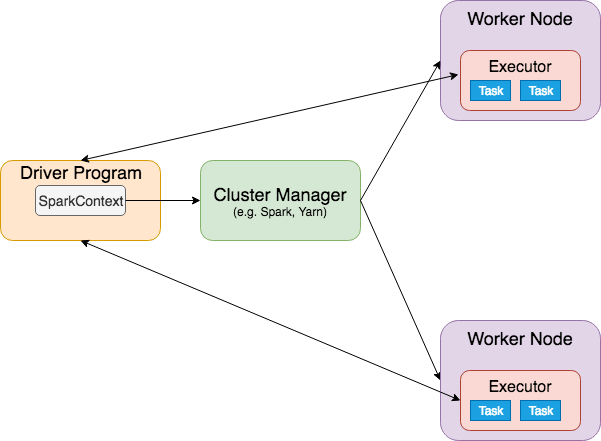
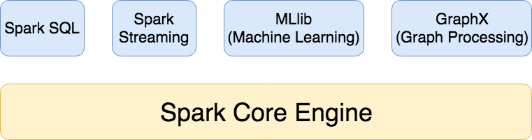

**Apache Spark**{: .firstword} is a unified analytic engine for large-scale data processing.

In Layman language, its a framework used for distributed processing of large dataset. By distributed processing, we mean we run an operation on a cluster of computers. So as our data grows all we need to do is to scale horizontally to meet our requirements.

<br/>

Apache Spark internally uses RDDs to do all the magic, so let's begin by understanding

## Resilient Distributed Dataset in Apache Spark
Spark is built on one main concept of **Resilient Distributed Dataset**{: .heading1} or **RDD**{: .heading1} which is an abstraction over giant distributed data. Internally it is an immutable collection of objects logically partitioned across multiple nodes of the cluster.

<br/>

RDD abstract away all the complexity that spark does for us viz
- **Fault tolerance and Resilience**{: .heading1} implying if a node goes down in a cluster it can recover from it and pick up from where it left off. A missing RDD can be recomputed from its lineage Graph.
- **Distribution**{: .heading1} implying the details of splitting of data and distributing it to the nodes of the cluster.

<br/>

We take these RDDs and then perform actions/transformations on them. 

<br/>

By **Transformation**{: .heading1}, we mean we take an RDD and apply a function on its data to create a new RDD. Few transformations functions that we can do on RDDs are map(), flatmap(), filter() etc.

<br/>

Transformations can be further divided into
- **Narrow Transformations**{: .heading1} where partitions of output RDD is generated from a single partition of parent RDD. For e.g. map(), flatmap(), filter(), union(), sample() etc.
- **Wide Transformations**{: .heading1} where even a single partition of output RDD is generated from a multiple partitions of parent RDD. For e.g. groupByKey(), reduceByKey(), distinct(), intersection() etc. Wide Transformations are also known as *Shuffle Transformations*

<br/>

By taking an **Action**{: .heading1} on RDD, we mean to apply a function to reduce it to an actual result that we want to retrieve at the end. Actions are RDD operations that produce non-RDD values. Few actions that we can perform on RDDs are collect(), count(), take() etc.

<br/>

In Spark, we can also save the result of RDD evaluation using an optimizing technique known as **RDD Persistence**{: .heading1} so that we can use it further if required. Hence reducing the computation overhead. Spark provides following two methods for persistence viz
- **cache()**{: .heading1} It persists all RDDs in memory with default storage level of **MEMORY_ONLY**
- **persist()**{: .heading1} In this option, we can use other storage levels (discussed below)

<br/>

Storage Levels of persisted RDD are as follows
- **MEMORY_ONLY**{: .heading1}: RDD is stored as deserialized Java object in JVM, and when the size of RDD is greater than the size of memory, it will not cache some partition and recompute them next time when needed
- **MEMORY_AND_DISK**{: .heading1}: RDD is stored as deserialized Java object in JVM, and when the size of RDD is greater than the size of memory, it stores excess partition on the disk
- **MEMORY_ONLY_SER**{: .heading1}: RDD is stored as serialized Java object
- **MEMORY_AND_DISK_SER**{: .heading1} RDD is stored as serialized Java object, and the partition that can't be stored in the memory is stored on disk
- **DISK_ONLY**{: .heading1}: RDD is stored only on Disk

<br/>

That's enough introduction of RDDs, let's drill into

## How Apache Spark works

An application written in Apache Spark broadly performs three major operations
- Loading data from a distributed data source, e.g., HDFS, S3, etc. and creating RDDs
- Building new RDDs from existing RDDs known as a *transformation*
- Collecting or Saving data from an RDD known as an *Action*

<br/>

In spark, the execution of transformation starts only when an *Action* is performed on RDD. 

<br/>

When an action is encountered spark **Driver Program** (i.e., the process running the main function) performs following steps in succession  
**Step 1:**{: .heading1} It first creates the DAG or execution plan (job) combining all the previous commands.  
**Step 2:**{: .heading1} It divides the DAG into stages depending on the shuffling of data between partitions. So a transformation that requires data shuffling has to be done in a separate stage.  
**Step 3:**{: .heading1} It then divides the stage into smaller tasks which are then given to executors. Spark runs one task for each partition.

<br/>

Did I mention executors? let's understand it by drilling into

## Cluster mode of Apache Spark

The real power of Apache Spark comes from the fact that the code that we run on a desktop for development purpose can be run on a cluster of machines which we can scale as large as we want (Horizontal Scaling).

<br/>

Spark application runs as an independent set of processes on a cluster of Machines. This cluster is set up on Master-Slave Architecture where the driver program is the master node and slave node can be used to perform computations.

<br/>

The cluster can be managed by sparks' own Standalone Cluster Manager, or we can use Hadoop Yarn, Apache Mesos, etc.

<br/>

The driver program first creates a **SparkContext** which encapsulates the underlying hardware that we are running on and negotiates with Cluster manager to provide resources for an application. 

<br/>

Once SparkContext is connected to Worker nodes, it starts executors on them which are Java processes that run tasks, have a cache and keep data in memory/disk storage. Each application has its executors which stay up for the duration of application and run tasks in multiple threads providing isolation between multiple applications.

<br/>

Finally, spark context sends tasks on the executors to run. For the entire life of **Driver Program**, it keeps on listening to the incoming connections from the executors and monitors them. In the end, it terminates all the executors and releases resources from the cluster manager.

<br/>

{:title="Apache Spark"}

<br/>

With above Architecture, Apache Spark claims to **Run workloads 100x faster** than Hadoop Map Reduce in memory for both batch and streaming data.

<br/>

Apache Spark has multiple components, let's have a brief overview of

## Components of Apache Spark

### Spark Core
Spark Core deals with RDDs, e.g., transforming them, collecting their results, tallying them, reducing things together 

<br/>

### Spark Streaming
Spark Streaming is built on top of Spark core and helps in dealing with a microburst of data coming in real time, for example, processing tweet stream and the likes. Data is aggregated/processed and analyzed in real time as it comes in.

<br/>

Spark Streaming breaks down data into chunks that can be processed together as small RDDs. We are not processing data byte by byte as it comes in, but instead, we process it 1 sec at a time. Technically, Spark streaming can be more precisely understood as microbatching of data instead of "Streaming".

<br/>

Spark streaming can be plugged into any variety of data sources, e.g., Amazon Kinesis, HDFS, Kafka, Flume, etc. Also to increase its fault tolerance, it has the concept of "Checkpointing" where it stores state to disk periodically. So in case of failure, it can pick up where it left off.

<br/>

### Spark SQL
Spark SQL provides a SQL like an interface to spark we can run SQL like queries on distributed datasets that we have processed using Spark

<br/>

It basically extends `RDD` to `DataFrame` Object in which we wrap structured data. In a nutshell, DataFrame is a Dataset of row objects.  
```DataFrame = (DataSet[Row])```

<br/>

Dataset is a set of Structured data, i.e. a specific type in scala e.g., DataSet[Person], DataSet[(String, Double )], etc. A big advantage of that is scala knows at compile time what's in that dataset so that it can complain in case of errors. Keep in mind, DataFrames schema is inferred at compile time.

<br/>

Benefits of using DataFrame are as follows
- We can treat it as SQL Table and can run SQL queries on it.
- It has a schema (leading to more efficient storage)
- We can import/write data in database format

<br/>

### MLLib
MLLib is used for machine learning operations on massive datasets, e.g., Linear regression, etc. MLLib has built-in routines that distribute the load across the cluster to process massive datasets and do ML on them.

<br/>

Some of the MLLIB Capabilities are as follows
- Feature extraction, e.g., Term Frequency, inverse document frequency, etc
- Basic statistics, e.g., min, max, mean, variance, etc
- Linear Regression, logistic regression
- Support Vector Machine
- Naive Bayes classifier
- Decision Tree
- K-Mean clustering
- Dimensionality Reduction Techniques, e.g., Principal Component Analysis, etc

<br/>

### GraphX
GraphX is a component of Spark for graphs and graph-parallel computation. It extends the Spark RDD providing a directed multigraph with properties attached to each vertex and edge. It supports fundamental operations like, e.g., subgraph, JoinVertices, etc. and an optimized version of Pregel API.

<br/>

An intuitive example is a graph of social network where each vertex represents an individual on that network, and each edge defines the relationship between them.

<br/>

We can use GraphX to get high-level information from the social network graph, e.g., average path length, connectedness, the degree of distribution, etc. We can even join or transform a graph.

<br/>

{:title="Apache Components"}

<br/>

That's enough of theory, let's look into 

## Software Installation

### Install Java
Use [this](https://www.java.com/en/download/){:target="_blank"} link to install Java 8.  

### Install Apache Spark
We can use Homebrew to install Apache Spark by hitting `brew install apache-spark`.  

<br/>

To install a specific version of Spark, do the following steps
- Switch directory to Homebrew Core `cd "$(brew --repo homebrew/core)"`
- Get the specific commit version from git log of apache-spark `git log Formula/apache-spark.rb`  

<br/>

Logs from above command

```py
commit 3f87077fc54590e73051360d1a60c610d5590e3a
Author: Jason Piper <j.piper@me.com>
Date:   Fri Nov 9 14:39:02 2018 +0000

    apache-spark 2.4.0

    Closes #33955.

    Signed-off-by: Jan Viljanen <527069+javian@users.noreply.github.com>

commit 0f3992a1e6d036dab8b420903d856231e7701ba1
Author: Dongjoon Hyun <dongjoon@apache.org>
Date:   Sun Oct 7 00:48:00 2018 -0700

    apache-spark 2.3.2 (#32777)

commit 4afed81f1396f8f2df3bbf45b4b70f04cd87b07c
Author: ilovezfs <ilovezfs@icloud.com>
Date:   Sat Jun 9 23:54:47 2018 -0700

    apache-spark 2.3.1 (#28833)

```

<br/>

- Check out specific git version `git checkout -b  apache-spark-2.3.2 0f3992a1e6d036dab8b420903d856231e7701ba1`
- Unlink the original version `brew unlink apache-spark`
- Install the apache spark `HOMEBREW_NO_AUTO_UPDATE=1 brew install apache-spark`
- After Installation you can check the spark version by `brew list apache-spark --versions`
- Clean Up
  - git checkout master
  - git branch -d apache-spark-2.2.0 
- Check Scala Shell for Spark using `spark-shell`
- Check Python Shell for Spark using `pyspark`

### Install IDE
You can use [Scala IDE](http://scala-ide.org/){:target="_blank" rel="nofollow" rel="noopener"} to develop your project. 

<br/>

In my case, I'm using IntelliJ  
You can watch [this](https://www.youtube.com/watch?v=u0FLmrnAm5k){:target="_blank" rel="nofollow" rel="noopener"} video to setup IntelliJ and learn the basics of creating SBT project.

### Install Build Tool
We will use Homebrew to install SBT, `brew install sbt`

<br/>

That's all we need as of now. 

<br/>

Let's build a sample machine learning application performing 
## Linear Regression using Apache Spark

<br/>

In a nutshell,
> Linear Regression is a technique to find the best fitting line to a bunch of points by minimizing the squared-error between each point

<br/>

I've discussed Machine Learning deeply in [this](){:target="_blank"} post, regression algorithms in [this](){:target="_blank"} post and classification algorithms in [this](){:target="_blank"} post.

<br/>

You may have a look at it for brushing up the concepts.

<br/>

Let's quickly create a model based on the following data, Where we would be predicting the `Salary` based on `Years of Experience` that a particular candidate has

<br/>


| YearsExperience | Salary |
|-----------------|--------|
| 1.1             | 39343  |
| 1.3             | 46205  |
| 1.5             | 37731  |
| 2               | 43525  |
| 2.2             | 39891  |
| 2.9             | 56642  |
| 3               | 60150  |
| 3.2             | 54445  |

<br/>

Click [here](https://github.com/kamranalinitb/machine-learning/blob/master/data/Part%202%20-%20Regression/Section%204%20-%20Simple%20Linear%20Regression/Salary_Data.csv){:target="_blank" rel="nofollow" rel="noopener"} to get Full data.  
**Data Credits**{: .exception} This data is take from [**Superdatascience**](https://www.superdatascience.com/machine-learning/ ){:target="_blank" rel="nofollow" rel="noopener"} data set

<br/>

As a side note, Apache Spark supports Java, Scala, Python, R, and SQL. I would like to use Scala to write jobs because of following reasons
- Spark itself is written in Scala
- All latest features come in Scala library first then its ported to other languages
- Scala gives the best performance on spark, and its functional programming model is a good fit for distributed processing

<br/>

We will be using `spark.ml` instead of `spark.mllib` which is a new way of doing ML from Spark 2.0 based on DataFrames.  
I can understand it's not always feasible to frame our problem in terms of SQL datasets, so old API is still there. However, the benefits of using spark.ml are as follows
- It performs better than mllib
- It will be interoperable better with Spark Streaming, Spark SQL, etc

<br/>

Enough of theory I guess, Let's write some code starting with
<br/>

**Step 1:**{: .heading1} **Creating SparkSession and Loading the data as RDD**{: .heading2}  
In Spark 2.0, we create an object of SparkSession to work with datasets, Spark SQL etc

<br/>

```scala
// Spark Session Interface in spark 2.0
val spark = SparkSession.builder
  .appName("SalaryPredictionDF")
  .master("local[*]") // using all cores of CPU
  .getOrCreate()

val inputLines = spark.sparkContext.textFile("./src/main/resources/salary_data.txt")
```

<br/>

**Step 2:**{: .heading1} **Structuring our data**{: .heading2}  
We need to impart structure on our data before creating a dataset our of it

<br/>

We will extract the first and second columns of our data. Column 1 contains `YearsExperience` which represents the feature based on which we will predicting the `Salary`  i.e., target variable.

<br/>

In spark terminology, Column 1 will be our `label` and Column 2 will represent a `Vector` of features

<br/>

```scala
val data = inputLines.map(_.split(",")).map( x => (x(1).toDouble, Vectors.dense(x(0).toDouble)))
```
<br/>

**Step 3:**{: .heading1} **Converting RDD to DataFrame**{: .heading2}  

Below code helps us in achieving that
```scala
// Converting data to DataFrame
import spark.implicits._

// Creating Sequence of Column Names
val colNames = Seq("label", "features")
val df = data.toDF(colNames: _*) // Converting Sequence to Variable Argument list using _* operator
```

<br/>

**Step 4:**{: .heading1} **Splitting the data into training and testing Data**{: .heading2}  
We will split the data into half randomly.  
The first half of data we will be using for building the model and the second half will be used for testing/evaluating the model to verify the efficiency of it.

<br/>

```scala
// Splitting our data into training and testing data
val trainTest = df.randomSplit(Array(0.5, 0.5))
val trainingDF = trainTest(0)
val testDF = trainTest(1)
```

<br/>

**Step 5:**{: .heading1} **Creating Linear Regression Model**{: .heading2}  

All the "Magic Numbers" used for creating the linear Regression object is beyond the scope of this tutorial. It's all about trying and testing for recommended values until we reach a sweet spot.

<br/>

```scala
// Creating linear regression model
val lir = new LinearRegression()
  .setRegParam(0.3) // regularization
  .setElasticNetParam(0.8)  // elastic net mixing
  .setMaxIter(100) // max iteration
  .setTol(1E-6) // convergence tolerance

// Train the model using training data
val model = lir.fit(trainingDF)
```

<br/>

**Step 6:**{: .heading1} **Predicting Salary from our model**{: .heading2}  

Let's predict the salary on our test data. `transform` function will add a prediction column on our test data frame. Then we can go ahead and compare the predicted values with actual values to verify the efficiency of our model.

<br/>

```scala
// Predicting values on our test data
// This will add a prediction column to test data
val fullPrecidtions = model.transform(testDF).cache()

val predictionAndLabel = fullPrecidtions.select("prediction", "label").rdd.map(x => (x.getDouble(0).round, x.getDouble(1).round))

// Printing predicted and actual values for each data point
for (prediction <- predictionAndLabel) {
  println(prediction)
}

spark.stop()
```

<br/>

Output looks like

```
(74432,83088)
(34409,37731)
(90231,91738)
(30196,39343)
(93391,98273)
(119722,112635)
(41782,39891)
(118669,116969)
(39676,43525)
(129201,121872)
(32303,46205)
(127094,122391)
(52314,54445)
(61794,57081)
(57581,57189)
(50208,60150)
(59687,63218)
(52314,64445)
(70220,67938)
```

<br/>

Some of them are decent predictions like (90231,91738), (57581,57189) and others are fairly close to each other except some outliers like (32303,46205), (74432,83088), etc

<br/>

You can have a look at the working project [here](https://github.com/kamranalinitb/spark/tree/master/salaryPrediction){:target="_blank" rel="nofollow" rel="noopener"}.

<br/>

This is how we can do Machine Learning using Apache Spark 2.0

<br/>

## Conclusion
In conclusion, I would like to say that Apache Spark is a powerful tool to solve Big data problems. All we need to do is to visualize the solution for a problem in spark semantics viz `reduceByKey()`, `reduceByValue()` etc. Rest is just a few lines of code in a language of our choice.

<br/>

Its performance over map-reduce and features like GraphX, Spark SQL, etc. make it a tool of choice for data engineers.

## Reference
- [Aapache Spark Org](https://spark.apache.org/){:target="_blank" rel="nofollow" rel="noopener"}
- [Aapache Spark Org, Cluster Overview](https://spark.apache.org/docs/latest/cluster-overview.html){:target="_blank" rel="nofollow" rel="noopener"}
- [Apache spark with scala hands on with big data](https://www.udemy.com/apache-spark-with-scala-hands-on-with-big-data/){:target="_blank" rel="nofollow" rel="noopener"}
- [Install Specific version of Apache Spark](https://stackoverflow.com/questions/49808951/how-to-install-apache-spark-2-2-0-with-homebrew-on-mac/49812624){:target="_blank" rel="nofollow" rel="noopener"}
- [Getting started with spark on osx](https://oleweidner.com/blog/2015/getting-started-with-spark-on-osx/){:target="_blank" rel="nofollow" rel="noopener"}
- [Graphx programming guide](https://spark.apache.org/docs/latest/graphx-programming-guide.html){:target="_blank" rel="nofollow" rel="noopener"}
- [DZone, How spark internally executes a program](https://dzone.com/articles/how-spark-internally-executes-a-program){:target="_blank" rel="nofollow" rel="noopener"}
- [Techvidvan, Spark Architecture](https://techvidvan.com/tutorials/spark-architecture/){:target="_blank" rel="nofollow" rel="noopener"}
- [Data flair, RDD Tutorial](https://data-flair.training/blogs/spark-rdd-tutorial/){:target="_blank" rel="nofollow" rel="noopener"}
- [Data flair, RDD Persistence and Caching](https://data-flair.training/blogs/apache-spark-rdd-persistence-caching/){:target="_blank" rel="nofollow" rel="noopener"}