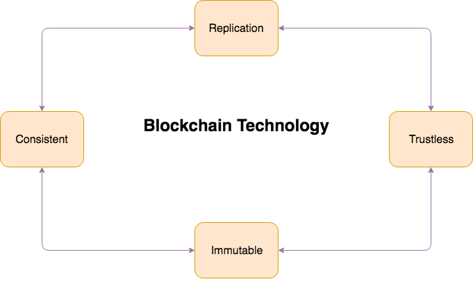

**Blockchain**{: .firstword}, the technology behind cypto currencies like **Bitcoin**, **Ethereum** etc. is a loud buzzword in software industry. It comes up with new set of tools, initially used to develop softwares dealing with financial transactions but can now be extended to other areas as well.

<br/>

The purpose of this article is to explain Blockchain Technology in simple words relating with day to day examples. It will be an introduction to blockchain without drilling into the complexities of *Private Key cryptography* and the likes.

<br/>

Setting the correct expectation, lets begin by answering 

## What is BlockChain Technology?
To understand Blockchain Technology, let's look into our day to day value transfer where a third party takes care of facilitating all the transactions in *Centralized* way for e.g banks for money, notary for land transfer etc maintaining a ledger.  

<br/>

This *Centralization* concentrates power in hands of few individuals. 

<br/>

**What if we return power back to people by *Decentralizing* it?**

<br/>

In November 2008, Satoshi Nakamoto published a Whitepaper for a new monetary system which has two main characteristics,
- All the nodes participating in *monetary system* contains the copy of all the transactional data. They share the responsibilty of adding new transactional data, removing the need of a central authority.
- Participating nodes are incentivize by a value created and stored in digital form on that monetary system.

<br/>

This digital monetary system is famously known as **Blockchain**.

<br/>

Then the question arises,

## How does Blockchain Technology work
Blockchain maintains a **Distributed Digital Ledger** on peer to peer network of nodes to store all the transaction information.

<br/>

Let's drill into Distributed Digital Ledger by first defining 

<br/>

### Ledger
A Ledger can be understood as an **ordered list of transactions** meant for book keeping.

<br/>

A simple ledger is shown below maintaining records of all the value transfers between multiple parties,

|    Date    | Value | Sender | Receiver |
|------------|-------|--------|----------|
| 2018-01-01 |  $10  | Kamran |  Palash  |
| 2018-01-02 |  $12  | Kamran |  Mayank  | 

<br/>

### Digital Ledger
 A Digital Ledger is the same ledger maintain over internet.

<br/>

### Distributed Digital Ledger
It means copy of the ledger maintained over internet exists on all the participating nodes on the network.

<br/>

Moving on let's look into

## Characteristics of Blockchain Technology
1. **Replication**{: .heading1}: Each node stores all the data and has power to decide which modifications in data are legitimate
2. **Consistent**{: .heading1}: Data stored in all the nodes is consistent i.e. all nodes have identical copies of data. Consistency in individual copies of data is maintained by using **Consensus Algorithm**, Which states
> A central point is elected and is responsible to modify the data and other nodes consider it as one source of truth. This central point is changed on regular and random basis between nodes.

3. **Immutable**{: .heading1}: Immutability implies we can't change history i.e. we can always track all the modifications from origin
4. **Trustless**{: .heading1}: Trustless environment implies nodes can join the network at any point in time, download data and start requesting changes without needing to trust them

<br/>

{:title="Blockchain Technology"}

<br/>

In simple words,
> Blockchain is a distributed digital ledger, where each ledger is made of chain of blocks related to each other by hashes having transaction information on them.

<br/>

Each block of blockchain consists of,
- Current transaction information
- HASH (Unique Identification Number of a block) of previous block

<br/>

Let's quickly look into a basic Java Implementation of Blockchain.

<br/>

We have **transaction.java** class holding the details of individual transaction like source, destination and sum.

```java
public class Transaction {

  private String source;
  private String destination;
  private Long sum;
}
```

<br/>

A **block.java** class which acts as a blueprint of each block in Blockchain.

```java
public class Block {

  private int previousHash; // <- HASH (Unique Identification Number of a block) of previous block
  private List<Transaction> transactionList; // <- Transaction information
}
```

<br/>

**BlockChain.java** class simulates a simple blockchain, where transaction1 and transaction2 are two transactions present in first block. Second block contains hash of first block and transaction3.  
This chain keeps on growing as and when new blocks are added.

```java
public class BlockChain {

  public static void main(String[] args) {

    Transaction transaction1 = new Transaction("Kamran", "Palash", 1000L);
    Transaction transaction2 = new Transaction("Palash", "Prakhar", 110L);

    Block block1 = new Block(0, Arrays.asList(transaction1, transaction2));

    /*
     Block2 has hash of previous block.
    */
    Transaction transaction3 = new Transaction("Prakhar", "Mayank", 120L);
    Block block2 = new Block(block1.hashCode(), Arrays.asList(transaction3));

  }
}
```

<br/>

In above example, we have seen how we are adding transaction information to new blocks and linking it to the previous chain of block. This new block is created by an elected node among all the participating nodes known as **mining nodes**.

<br/>

This election is based on an algorithm, first being

<br/>

### Proof of Work
> Proof of Work is a consensus algorithm in which computation power is deciding criteria to win an election.

<br/>

Suppose we want to append a value transfer between A and B to Blockchain. Value transfer is represented as transaction in Blockchain. To append this transaction following steps occurs in sequence

- A leader is elected among **Miner Nodes** who will append this transaction to a new block in Blockchain.
  - *Miner Nodes* are those which are participating in network to mine new blocks and are in turn incentivize by currency of network
- This election demands solving a computationally intensive mathematical problem within a specified time. That problem has two characteristics
  - Solving the problem is computationally intensive
  - Verifying the solution is easy
- Suppose node X solves the problem first and its solution is verified to be authentic
- This node now creates a new block add the above transaction into it and add it to the existing Blockchain

<br/>

Above algorithm is used in one of the most famous *cryptocurrency*, which is

<br/>

**Bitcoin**{: .heading1}  
Bitcoin is primarily designed for digital cash system and its language is limited to avoid any shady business. We use *Proof of Work* Algorithm for consensus, which states
> A Node solves a puzzle and once solution is proven and verified as correct; winner will get to decide which transactions get to append to ledger.

<br/>

- In every 10 mins there is a competition to decide which node will append which transaction to the ledger based on consensus algorithm
- Once node appends this block of transaction to ledger it is spread across the network and all nodes start working on this new basis 
- Winner of the competition gets to include a special transaction in the block that creates an amount of bitcoins and sends them to himself which is 12.5 bitcoin for every block and gets divided by 2 every four years
- Smallest unit of currency is 1 Satoshi
- **Drawback of Bitcoin:** Bitcoin doesn't support complex logic, loops etc hence is not *Turing Complete*.

<br/>

### Proof of Stake
> Proof of Stake is a consensus algorithm in which *Economic Stakes* are deciding criteria to win an election.

<br/>

Stake can be defined as the amount of wealth (currency of that Blockchain) that a miner is willing to put on stake i.e. lock up for a certain amount of time. Higher the stake higher his chances to win the next election i.e getting the opportunity to mine next block and earn reward.

<br/>

## Conclusion
In conclusion, I would like to reiterate that **Decentralized** nature i.e. no central authority Or governing power and immutability of transactions are truly game changing features of blockchain.

<br/>

We can use it to *Conduct Elections*, *Money Transfer*, *Digital Agreements* and what not.

## References
- [Getting Started With Ethereum Solidity Development](https://www.udemy.com/course/getting-started-with-ethereum-solidity-development/){:target="_blank" rel="nofollow" rel="noopener"}
- [Proof of Work & Proof of Stake](https://medium.com/loom-network/understanding-blockchain-fundamentals-part-2-proof-of-work-proof-of-stake-b6ae907c7edb){:target="_blank" rel="nofollow" rel="noopener"}
- [ethereum/wiki/wiki/Proof-of-Stake-FAQs](https://github.com/ethereum/wiki/wiki/Proof-of-Stake-FAQs#what-is-proof-of-stake){:target="_blank" rel="nofollow" rel="noopener"}
- [What is Blockchain? How does Blockchain Technology work? Tech Primers](https://www.youtube.com/watch?v=q0Y7XQZfPlM "What is Blockchain"){:target="_blank" rel="nofollow" rel="noopener"}  
- [Let's create custom BlockChain in Java, Create Block Chain Technology in Java](https://www.youtube.com/watch?v=UmCEdcRjaz0){:target="_blank" rel="nofollow" rel="noopener"}