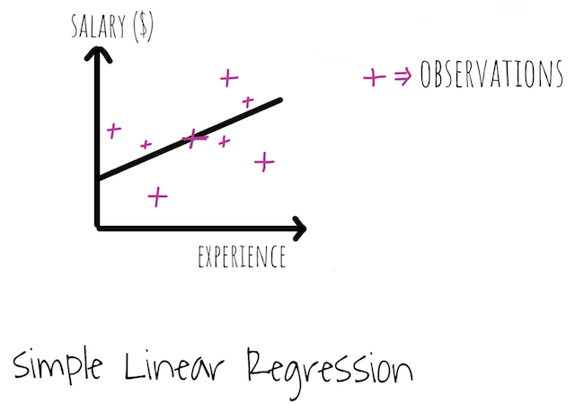

**Machine Learning**{: .firstword} is a branch of Artificial Intelligence in which computer systems are given the ability to learn from data and make predictions without being programmed explicitly or any need for human intervention.

<br/>

I've discussed this topic deeply in [this](/machine-learning/){:target="_blank"} post. So let's begin with answering

## What is Regression problem in Machine Learning
Regression technique is supervised learning which is used to predict real values like salary (dependent variable) for example with time (independent variable). There are multiple regression techniques,
- Simple Linear Regression
- Multiple Linear Regression
- Polynomial Regression
- Support Vector Regression (SVR)
- Decision Tree Regression
- Random Forest Regression

<br/>

Let's look into each one of machine learning algorithms of regression individually beginning with 

### Simple Linear Regression in Machine Learning
A Simple Linear Regression Technique is basically following formula,  

$$y = b_{0} + b_{1} x_{1}$$ where,   
$$y$$ = Dependent Variable (something we are trying to explain)  
$$x_{1}$$ = Independent Variable  
$$b_{1}$$ = Coefficient which determines how a unit change in x1 will cause a change in y  
$$b_{0}$$ = constant

<br/>

Suppose we have a ```Salary vs. Experience``` data and we want to predict ```Salary``` based on ```Experience```. Plotting the data, it looks something like,

{:title="Simple Linear Regression in Machine Learning"}

In our scenario regression equation looks like  
salary = $$b_{0}$$ + $$b_{1}$$*Experience, where  
$$b_{0}$$ = salary at zero experience  
$$b_{1}$$ = change in salary with increase in experience. Higher the b1 (slope) it will yield more salary with increase in experience

<br/>

We want to find the best fit line that best fits the observations marked as (+).

<br/>

**How to find that best fit line?**

<br/>

{:title="Chart"}

In the above diagram, let L1 be the line representing the simple linear regression model. We have drawn green lines from the actual observation (+) to the model.

<br/>

**a1** = tell us where the person should be sitting according to the model in terms of salary, i.e. model-observation  
**a2** = Actual salary of the person  
**green line** = Difference between what he's actually earning and what he should earn according to model.

<br/>

To find the best fitting line, we do the following  
- Squaring all the green lines, i.e. ```(a1-a2)²```
- Summing up the squared green lines, i.e. ```Σ(a1-a2)²```
- Best fit line is ``` min(Σ(a1-a2)²)```

<br/>

Let's quickly create a model based on the following data, Where we would be predicting the salary based on years of experience that a particular candidate has

<br/>


| YearsExperience | Salary |
|-----------------|--------|
| 1.1             | 39343  |
| 1.3             | 46205  |
| 1.5             | 37731  |
| 2               | 43525  |
| 2.2             | 39891  |
| 2.9             | 56642  |
| 3               | 60150  |
| 3.2             | 54445  |
| 3.2             | 64445  |
| 3.7             | 57189  |
| 3.9             | 63218  |
| 4               | 55794  |
| 4               | 56957  |
| 4.1             | 57081  |
| 4.5             | 61111  |
| 4.9             | 67938  |
| 5.1             | 66029  |
| 5.3             | 83088  |
| 5.9             | 81363  |
| 6               | 93940  |
| 6.8             | 91738  |
| 7.1             | 98273  |
| 7.9             | 101302 |
| 8.2             | 113812 |
| 8.7             | 109431 |
| 9               | 105582 |
| 9.5             | 116969 |
| 9.6             | 112635 |
| 10.3            | 122391 |
| 10.5            | 121872 |

<br/>

Click [here](https://github.com/atechguide/machine-learning/blob/master/algorithms/regression/simple_linear_regression/Salary_Data.csv){:target="_blank" rel="nofollow" rel="noopener"} to get Full data.  
**Data Credits**{: .exception} All the data used in this tutorial is take from [**Superdatascience**](https://www.superdatascience.com/machine-learning/ ){:target="_blank" rel="nofollow" rel="noopener"} data set

<br/>

So let's quickly start with

<br/>

**Step 1:**{: .heading2} Loading and processing the data  

```py
import numpy as np
import matplotlib.pyplot as plt
import pandas as pd

# Importing the dataset
dataset = pd.read_csv('Salary_Data.csv')
X = dataset.iloc[:, :-1].values # Independent Variable
y = dataset.iloc[:, 1].values # Dependent Variable

# Splitting the dataset into the Training set and Test set
from sklearn.model_selection import train_test_split
X_train, X_test, y_train, y_test = train_test_split(X, y, test_size = 1/3, random_state = 0)

# We don't need feature scaling because the LinearRegression library will take care of it
```

<br/>

**Step 2:**{: .heading2} Fitting Simple Linear Regression to training data  

```py
# Fitting Simple Linear Regression to the Training set
from sklearn.linear_model import LinearRegression
linearRegressor = LinearRegression() # creating linearRegressor object
linearRegressor.fit(X_train, y_train) # Fitting model with training set
```

<br/>

Next step is to check how our Simple Linear Regression machine learned the correlation in training by looking into predictions on test set observations

<br/>

**Step 3:**{: .heading2} Creating a Vector of Predicted Values

```py
# Predicting the Test set results
prediction = linearRegressor.predict(X_test)
```
<br/>

Finally lets plot the predictions of linear regression model w.r.t. real observations.

<br/>

**Step 4:**{: .heading2} Visualization of Model w.r.t. training set

```py
plt.scatter(X_train, y_train, color = 'red')
plt.plot(X_train, linearRegressor.predict(X_train), color = 'blue')
# Y coordinate is the prediction of train set
plt.title('Salary vs Experience (Training set)')
plt.xlabel('Experience')
plt.ylabel('Salary')
plt.show()
```

<br/>

It looks something like
{:title="Training Set"}

<br/>

In the above graph, real values are red dots and predicted values are in the blue simple linear regression line

<br/>

**Step 5:**{: .heading2} Visualization of Model w.r.t. test set

```py
plt.scatter(X_test, y_test, color = 'red')
plt.plot(X_train, linearRegressor.predict(X_train), color = 'blue')
# We will obtain same linear regression line by plotting it with either train set or test set
plt.title('Salary vs Experience (Test set)')
plt.xlabel('Experience')
plt.ylabel('Salary')
plt.show()
```

<br/>

It looks something like
{:title="Test Set"}

<br/>

In the above graph, red dots are observations of the test set and predicted values are in blue simple linear regression line.

<br/>

Moving On let's look into another Machine Learning Technique, which is

### Multiple Linear Regression in Machine Learning
Multiple Linear Regression Technique is basically following formula,  

$$y = b_{0}  + b_{1} x_{1} + b_{2} x_{2}  + ... +  b_{n} x_{n}$$ where,   
$$y$$ = Dependent Variable (something we are trying to explain)  
$$x_{1}$$, $$x_{2}$$, $$x_{n}$$ = Independent Variable  
$$b_{1}$$, $$b_{2}$$, $$b_{n}$$ = Coefficient which determines how a unit change in $$x_{1}$$ will cause a change in $$y$$  
$$b_{0}$$ = constant

<br/>

Multiple regression extends linear regression in which we predict a dependent variable based on multiple independent variables. For example, `Salary` of a person will be dependent on his `experience` , `certification`, `courses` and so on

<br/>

Similarly, suppose a venture capitalist is looking to spend his money on startups. He looks into the portfolio of each company which looks like,

<br/>


| R&D Spend | Administration | Marketing Spend | State    | Profit    |
|-----------|----------------|-----------------|----------|-----------|
| 165349.2  | 136897.8       | 471784.1        | New York | 192261.83 |
| 162597.7  | 151377.59      | 443898.53       | Florida  | 191792.06 |
| 153441.51 | 101145.55      | 407934.54       | Florida  | 191050.39 |
| 144372.41 | 118671.85      | 383199.62       | New York | 182901.99 |
| 142107.34 | 91391.77       | 366168.42       | Florida  | 166187.94 |
| 131876.9  | 99814.71       | 362861.36       | New York | 156991.12 |
| 134615.46 | 147198.87      | 127716.82       | New York | 156122.51 |
| 130298.13 | 145530.06      | 323876.68       | Florida  | 155752.6  |

<br/>

Click [here](https://github.com/atechguide/machine-learning/blob/master/algorithms/regression/multiple_linear_regression/50_Startups.csv){:target="_blank" rel="nofollow" rel="noopener"} to get Full data.  
**Data Credits**{: .exception} All the data used in this tutorial is take from [**Superdatascience**](https://www.superdatascience.com/machine-learning/ ){:target="_blank" rel="nofollow" rel="noopener"} data set

<br/>

To maximize the profit of his investment, he looks into all the independent variables viz, R&D Spend, Administration, Marketing Spend, State and wants to draw a correlation between them and profit (Dependent Variable).

<br/>

A Multiple Linear Regression equation looks like,  

$$y$$ = $$b_{0}$$ + $$b_{1}$$* (R&D Spend) + $$b_{2}$$* (Administration) + $$b_{3}$$* (Marketing Spend) + $$b_{4}$$* (State) ```

<br/>

let's quickly move on to build a model based on the above data.

<br/>
 
Below is a step by step approach to accomplish that

<br/>

**Step 1:**{: .heading2} **Loading the data**  
Let me remind you to set your working directly correctly before importing the dataset

```py
# Data Preprocessing Template

# Importing the libraries
import numpy as np
import matplotlib.pyplot as plt
import pandas as pd

# Importing the dataset
dataset = pd.read_csv('50_Startups.csv')
X = dataset.iloc[:, :-1].values # Independent Variable
y = dataset.iloc[:, 4].values # Dependent Variable
```

<br/>

**Step 2:**{: .heading2} **Encoding the categorical variable (State)**  
One fine point to note here is `State` is a Categorical Variable, so we need to convert it to Numerical variable to be able to use it for Mathematical Equation. 

<br/>

We will follow the **Step 5**{: .heading2} dicussed in [this](/machine-learning/){:target="_blank"} post to create dummy Variables of each category (New York and Florida in our case).

<br/>

After creating Dummy Variables, our data looks like,

<br/>


| R&D Spend | Administration | Marketing Spend | New York | Florida | Profit    |
|-----------|----------------|-----------------|----------|---------|-----------|
| 165349.2  | 136897.8       | 471784.1        | 1        | 0       | 192261.83 |
| 162597.7  | 151377.59      | 443898.53       | 0        | 1       | 191792.06 |
| 153441.51 | 101145.55      | 407934.54       | 0        | 1       | 191050.39 |
| 144372.41 | 118671.85      | 383199.62       | 1        | 0       | 182901.99 |
| 142107.34 | 91391.77       | 366168.42       | 0        | 1       | 166187.94 |
| 131876.9  | 99814.71       | 362861.36       | 1        | 0       | 156991.12 |
| 134615.46 | 147198.87      | 127716.82       | 1        | 0       | 156122.51 |
| 130298.13 | 145530.06      | 323876.68       | 0        | 1       | 155752.6  |

<br/>

If we only keep `New York` column all our data is preserved as 1 in *New York* column means `New York` and 0 means `Florida`. So let's drop `Florida` column.

<br/>

After dropping Florida it looks like,

<br/>


| R&D Spend | Administration | Marketing Spend | New York | Profit    |
|-----------|----------------|-----------------|----------|-----------|
| 165349.2  | 136897.8       | 471784.1        | 1        | 192261.83 |
| 162597.7  | 151377.59      | 443898.53       | 0        | 191792.06 |
| 153441.51 | 101145.55      | 407934.54       | 0        | 191050.39 |
| 144372.41 | 118671.85      | 383199.62       | 1        | 182901.99 |
| 142107.34 | 91391.77       | 366168.42       | 0        | 166187.94 |
| 131876.9  | 99814.71       | 362861.36       | 1        | 156991.12 |
| 134615.46 | 147198.87      | 127716.82       | 1        | 156122.51 |
| 130298.13 | 145530.06      | 323876.68       | 0        | 155752.6  |

<br/>

Below is the code to achieve that

```py
# Encoding the categorical variable (State)
from sklearn.preprocessing import LabelEncoder, OneHotEncoder
labelencoder_X = LabelEncoder()
X[:, 3] = labelencoder_X.fit_transform(X[:, 3]) 
onehotencoder = OneHotEncoder(categorical_features = [3])
X = onehotencoder.fit_transform(X).toarray()

# Avoiding the Dummy Variable Trap
X = X[:, 1:] # Removed first column from X
```
<br/>

**Step 3:**{: .heading2} **Splitting the dataset into the Training set and Test set** 

```py
# Splitting the dataset into the Training set and Test set
from sklearn.cross_validation import train_test_split
X_train, X_test, y_train, y_test = train_test_split(X, y, test_size = 0.2, random_state = 0)
```

<br/>

**Step 4:**{: .heading2} **Fitting Multiple Linear Regression to training data**  

```py
# Fitting Multiple Linear Regression to the Training set
from sklearn.linear_model import LinearRegression
regressor = LinearRegression()
regressor.fit(X_train, y_train)
```

<br/>

Next step is to check how our Multiple Linear Regression machines learned the correlation in training by looking into predictions on test set observations

<br/>

**PS:**As we have four independent variables and one dependent variable, we would need five dimensions for visual plotting which is hard to represent. So we are skipping that.

<br/>

**Step 5:**{: .heading2} **Predicting the Test set results** 
```py
# Predicting the Test set results
y_pred = regressor.predict(X_test)
```

<br/>

Comparison between y_pred and y_test looks like,

<br/>


| Y_pred  | Y_test  |
|---------|---------|
| 103015 | 103282 |
| 132582  | 144259  |
| 132448  | 146122  |
| 71976.1 | 77798.8 |
| 178537  | 191050  |
| 116161  | 105008  |
| 67851.7 | 81229.1 |
| 98791.7 | 97483.6 |
| 113969  | 110352  |
| 167921  | 166188  |

<br/>

In row 1, Actual profit is `103282` and our model predicted `103015` which is an amazing prediction.  
In row 8, Actual profit is `97483.6` and our model predicted `98791.7` which is again a fantastic prediction.

<br/>

That's decent predictions. However, can we further improve the model?

<br/>

Out of all the independent variables some are highly statistically significant (i.e., they have a high impact on the dependent variable) and some are not. 

<br/>

To find out the statistical significance of independent variable we have the following 5 techniques
- All In
- Backward Elimination
- Forward Selection
- Bidirectional Elimination
- Score Comparison

<br/>

Let's look into them one by one, starting with

<br/>

**All In**{: .heading1}  
In this method, we choose all the independent variables to build a model.  

<br/>

We choose this path when either we have prior knowledge that all the variables are true predictors OR a framework/company dictates it.

<br/>

That's what we have done in building the above model.

<br/>

Moving on let's explore 

<br/>

**Backward Elimination**{: .heading1}  
In this method we need to follow following steps,

<br/>

**Step 1**{: .heading2} Select significave level to stay in model (e.g. SL = .05 i.e. 5%)  
**Step 2**{: .heading2} Fit the model with all the predictors i.e. use all independent variables  
**Step 3**{: .heading2} Consider predictor with highest ```P Value```. If P > SL, go to **Step 4**{: .heading2}, else go to FINISH  
**PS:** *P value* briefly is the statistical measure to determine wheather or not the hypotheses is correct or not. *P value*   below a certain pre-determined amount (e.g. 0.05), means the hypothesis that t*his variables had no meaningful effect on the results* is rejected.  
**Step 4**{: .heading2} Remove that predictor  
**Step 5**{: .heading2} Fit the model without this variable  

<br/>

After **Step 5**{: .heading2}, Go to **Step 3**{: .heading2} and repeat till the highest P value is < SL

<br/>

Moving on. Let's look into

<br/>

**Forward Selection**{: .heading1}  
In this method we need to follow following steps,

<br/>

**Step 1**{: .heading2} Select significave level to enter in the model (e.g. SL = .05 i.e. 5%)

<br/>

**Step 2**{: .heading2} Create a regression model of the dependent variable with all the independent variable. From all those models select the one with the lowest P value.  
For example, Y is independent variable and x1, x2, x3 are independent variables. We will create the model of Y with x1 then x2 then x3. Let's say model with x2 has the lowest P value so we will choose it.  

<br/>

**Step 3**{: .heading2} Create a regression model of dependent Variable with the chosen variable in **Step 2**{: .heading2} and one extra predictor.  
Continuing with the above example, Now we will build a model of Y with (x2, x1) and (x2, x3).  

<br/>

**Step 4**{: .heading2} From all those models select the one with lowest P value. If P < SL, go to **Step 3**{: .heading2}, else go to finish.  
Suppose a model of Y with (x2, x1) has lowest P value and it less than SL. So we will choose it and will continue with **step 3**. Also, we will keep doing that until we hit a model whose lowest P value (in the current iteration) is higher than SL, then we will exit. Also, make sure while exiting, we are keeping the previous model, not the current model (i.e., whose P value is > SL).

<br/>

Next model that we will learn will combine **Backward Elimination** and **Forward Selection** and is known as 

<br/>

**Bidirectional Elimination**{: .heading1}  
In this method we need to follow following steps,

<br/>

**Step 1**{: .heading2} Select significave level to enter in the model e.g. SLENTER = .05 and to stay in the model e.g. SLSTAY = .05  
**Step 2**{: .heading2} Perform the next step of forward selection.  
**Step 3**{: .heading2} Perform ALL the next step of backward elemination.  
What we mean here is suppose we went from 5 independent variables to 6 in the previous step of forward selection. Now we will perform all the steps of backward elimination instead of eliminating just one variable.  
**Step 4**{: .heading2} Keep on repeating **Step 3**{: .heading2} and **Step 4**{: .heading2} till a point where no new variable can enter, and no old variable can exit. Proceed to finish, and now our model is ready.  

<br/>

Finally the last approach, which is 

<br/>

**All Possible Models**{: .heading1}  
In this method we need to follow following steps,

<br/>

**Step 1**{: .heading2} Select a criterion of goodness of fit e.g. Akaike criterion.  
**Step 2**{: .heading2} Construct all possible Regression Models i.e. 2^n -1 total combinations.  
**Step 3**{: .heading2} Select the one with the best criterion. Proceed to finish and now our model is ready.  

<br/>

This is the most resource-consuming technique. Suppose we have 10 columns we will generate 1023 models which require insane compute.

<br/>

We now have a brief knowledge of how each technique works.
In our post, we will choose the statistically significant variables by using 

<br/>

**Backward Elimination Method**{: .heading1}  
**Step 1:**{: .heading2} **Adding a row corresponding to x0 in our Multiple Linear Equation**  
Multiple Linear equation is of form ``` y = b0 + b1*x1 + b2*x2 ..... bn*xn ```, with b0 there is an X0 = 1 associated with it.  

<br/>

In sklearn linear models that x0 is taken care of by library itself. However, in the statsmodel library (which we will use for backward elimination), we need to add a row for x0 = 1 ourselves

<br/>

Below code will help in accomplishing it,

```py
# Building optimal model using backward elimination
import statsmodels.formula.api as sm
X = np.append(arr = np.ones((50, 1)).astype(int), values = X, axis=1)
```

<br/>

**Step 2:**{: .heading2} **Building an array of statistically significant independent Variables**  
Let's call thay array as X_opt 

```py
X_opt = X[:, [0,1,2,3,4,5]] ## Initially X_opt contains all the independent Variables

## Fitting the model with statsmodels regressor with all indenpendent Variables (i.e. all possible predectors)
regressor_OLS = sm.OLS(endog = y, exog = X_opt).fit() 
regressor_OLS.summary() ## To check the summary

## From the summary we can check the P value of each variable and remove the one
## with the highest P Value
```

<br/>

 O/P of `regressor_OLS.summary()`

```py
                            OLS Regression Results                            
==============================================================================
Dep. Variable:                      y   R-squared:                       0.951
Model:                            OLS   Adj. R-squared:                  0.945
Method:                 Least Squares   F-statistic:                     169.9
Date:                Tue, 01 Jan 2019   Prob (F-statistic):           1.34e-27
Time:                        19:05:51   Log-Likelihood:                -525.38
No. Observations:                  50   AIC:                             1063.
Df Residuals:                      44   BIC:                             1074.
Df Model:                           5                                         
Covariance Type:            nonrobust                                         
==============================================================================
                 coef    std err          t      P>|t|      [0.025      0.975]
------------------------------------------------------------------------------
const       5.013e+04   6884.820      7.281      0.000    3.62e+04     6.4e+04
x1           198.7888   3371.007      0.059      0.953   -6595.030    6992.607
x2           -41.8870   3256.039     -0.013      0.990   -6604.003    6520.229
x3             0.8060      0.046     17.369      0.000       0.712       0.900
x4            -0.0270      0.052     -0.517      0.608      -0.132       0.078
x5             0.0270      0.017      1.574      0.123      -0.008       0.062
==============================================================================
Omnibus:                       14.782   Durbin-Watson:                   1.283
Prob(Omnibus):                  0.001   Jarque-Bera (JB):               21.266
Skew:                          -0.948   Prob(JB):                     2.41e-05
Kurtosis:                       5.572   Cond. No.                     1.45e+06
==============================================================================
```

<br/>

`X2 has highest P value greater than SL (where SL = .05)`

<br/>

So lets remove x2

```py
## Removing X2 and fitting the model without X2 i.e. index = 2
X_opt = X[:, [0,1,3,4,5]]
regressor_OLS = sm.OLS(endog = y, exog = X_opt).fit() 
regressor_OLS.summary()
```

<br/>

Again the variable with highest P Value is with index = 1 (from the summary) so we will remove it now

```py
## Removing index = 1 and fitting the model
X_opt = X[:, [0,3,4,5]]
regressor_OLS = sm.OLS(endog = y, exog = X_opt).fit() 
regressor_OLS.summary()
```

<br/>

From summary we see index = 4 having highest value so lets remove it

```py
## Removing index = 4 and fitting the model
X_opt = X[:, [0,3,5]]
regressor_OLS = sm.OLS(endog = y, exog = X_opt).fit() 
regressor_OLS.summary()
```
<br/>

Now we see index = 5 with p value 0.06 which is slightly above .05 SL which we remove it

```py
## Removing index = 5 and fitting the model
X_opt = X[:, [0,3]]
regressor_OLS = sm.OLS(endog = y, exog = X_opt).fit() 
regressor_OLS.summary()
```

<br/>

From the summary, we see all p values < .05. So now we have the strong predictor which is index = 3 i.e., **R&D Spend**

<br/>

Moving on Let's look into

### Polynomial Linear Regression in Machine Learning
Polynomial Regression Technique is basically following formula,  

$$y = b_{0}  + b_{1} x_{1}  + b_{2} x^{2}_{1}  + ... + b_{n} x^{n}_{1}$$ where,   
$$y$$ = Dependent Variable (something we are trying to explain)  
$$x_{1}$$ = Independent  Variable  
$$b_{1}$$, $$b_{2}$$, $$b_{n}$$ = Coefficient which determines how a unit change in x1 will cause a change in y  
$$b_{0}$$ = constant

<br/>

If we have a data set as seen in the below figure we recognize that it doesn't fit that well by a linear line. What we can do is to use polynomial regression formula to fit the data set perfectly by a parabolic figure.

{:title="Polynomial Linear Regression in Machine Learning"}

<br/>

Even though it is a polynomial equation with $$x_{1}$$, $$x^{2}$$ etc, We call it Polynomial **Linear** Regression as its linearly is due to the fact of Coefficient that we are using i.e. $$b_{1}$$, $$b_{2}$$, $$b_{n}$$ 

<br/>

Let’s quickly create a model based on the following data, Where we would like to predict the Salary of a particular candidate based on its level

<br/>


| Position          | Level | Salary  |
|-------------------|-------|---------|
| Business Analyst  | 1     | 45000   |
| Junior Consultant | 2     | 50000   |
| Senior Consultant | 3     | 60000   |
| Manager           | 4     | 80000   |
| Country Manager   | 5     | 110000  |
| Region Manager    | 6     | 150000  |
| Partner           | 7     | 200000  |
| Senior Partner    | 8     | 300000  |
| C-level           | 9     | 500000  |
| CEO               | 10    | 1000000 |

<br/>

Click [here](https://github.com/atechguide/machine-learning/blob/master/algorithms/regression/polynomial_regression/Position_Salaries.csv){:target="_blank" rel="nofollow" rel="noopener"} to get Full data.  
**Data Credits**{: .exception} All the data used in this tutorial is take from [**Superdatascience**](https://www.superdatascience.com/machine-learning/ ){:target="_blank" rel="nofollow" rel="noopener"} data set

<br/>

**Step 1:**{: .heading2} Loading and processing the data

```py
# Polynomial Regression

# Importing the libraries
import numpy as np
import matplotlib.pyplot as plt
import pandas as pd

# Importing the dataset
dataset = pd.read_csv('Position_Salaries.csv')
X = dataset.iloc[:, 1:2].values ## Choosing level
y = dataset.iloc[:, 2].values  ## Choosing Salary

# We don't have enough data so we will not be splitting it into test set and training set
# Also we don't need to apply feature scaling as the library does it by itself
```
<br/>

**Step 2:**{: .heading2} Fitting Polynomial Linear Regression to training data

```py
# Fitting Linear Regression to the dataset
from sklearn.linear_model import LinearRegression
linearRegressor = LinearRegression()
linearRegressor.fit(X,y) # We have also created a linear model to compare its efficiency with polynomial model


# Fitting Polynomial Regression to the dataset
from sklearn.preprocessing import PolynomialFeatures
polyRegression = PolynomialFeatures(degree=2) ## We are choosing a degree of 2

X_poly = polyRegression.fit_transform(X) ## Creating new metrics X_poly with polynomial feature

lin_reg_2 = LinearRegression() 
lin_reg_2.fit(X_poly, y) # Creating a polynomial model with polinomial metrics X_poly
```

<br/>


X_poly looks like

| 1 | 1  | 1   |
|---|----|-----|
| 1 | 2  | 4   |
| 1 | 3  | 9   |
| 1 | 4  | 16  |
| 1 | 5  | 25  |
| 1 | 6  | 36  |
| 1 | 7  | 49  |
| 1 | 8  | 64  |
| 1 | 9  | 81  |
| 1 | 10 | 100 |

Where the first column represents constant and third column is the polynomial term

<br/>

**Step 3:**{: .heading2} Visualisation of Linear Regression Vs Polynomial Regression

```py
# Visualisation of Linear Regression
plt.scatter(X, y, color = 'red')
plt.plot(X, linearRegressor.predict(X), color = 'blue') # Blue line is the prediction of linear regression model
plt.title('Linear Regression')
plt.xlabel('Position Level')
plt.ylabel('Salary')
plt.show()
```

<br/>

The graph for Linear Regression looks like
{:title="Linear Regression Prediction"}

<br/>

We can see that predictions are not that great except where red points are close to the blue line

<br/>

```py
# Visualisation of Polynomial Regression
plt.scatter(X, y, color = 'red')
plt.plot(X, lin_reg_2.predict(polyRegression.fit_transform(X)), color = 'blue') # Blue line is the prediction of linear regression model
plt.title('Polynomial Regression')
plt.xlabel('Position Level')
plt.ylabel('Salary')
plt.show()
```

<br/>

The graph for Polynomial Regression looks like
{:title="Polynomial Regression Prediction"}

<br/>

We can see that predictions are much better than a linear regression model

<br/>

To further improve the prediction lets increase the degree from 2 to 3 and the graph looks like
{:title="Polynomial Regression Prediction"}

<br/>

Which is an improvement over degree 2

<br/>

To further improve the prediction lets increase the degree from 3 to 4 and the graph looks like
{:title="Polynomial Regression Prediction"}

<br/>

Which is an improvement over degree 3 and our model curve passing through almost all the data points

<br/>

Can we apply any other regression model to get a decent result?

<br/>

The answer is **YES**, Let's explore another regression technique which is

### Support Vector Regression in Machine Learning

Support Vector Regression is a type of Support Vector Machine (details of which is outside the scope of this tutorial) which supports linear and non-linear regression. SVR performs linear regression in higher dimensional space where each data in training set represents its own dimension.

<br/>

The main goal of SVR is to **make sure the errors do not exceed the threshold**, unlike linear regression where we are trying to minimizing the error between prediction and data.

<br/>

We will analyze the dataset of Polynomial regression in Support Vector Regression (SVM), Code of which looks like,

<br/>

```py
# SVR

# Importing the libraries
import numpy as np
import matplotlib.pyplot as plt
import pandas as pd

# Importing the dataset
dataset = pd.read_csv('Position_Salaries.csv')
X = dataset.iloc[:, 1:2].values ## Choosing level
y = dataset.iloc[:, 2:3].values  ## Choosing Salary

# We don't have enough data so we will not be splitting it into test set and training set

# SVR class doesn't apply Feature Scaling so we need to do it ourself
from sklearn.preprocessing import StandardScaler
sc_X = StandardScaler()
sc_y = StandardScaler()

X = sc_X.fit_transform(X)
y = sc_y.fit_transform(y)

# Fitting SVR to the dataset
from sklearn.svm import SVR
svr_regression = SVR(kernel='rbf')  ## rbf kernel is for non linear problem
## Kernel defines wheather we need linear, polynomial or Gaussian SVR

svr_regression.fit(X, y)

# Visualisation of SVR results
plt.scatter(X, y, color = 'red')
plt.plot(X, svr_regression.predict(X), color = 'blue') # Blue line is the prediction of linear regression model
plt.title('SVR Regression')
plt.xlabel('Position Level')
plt.ylabel('Salary')
plt.show()
```

<br/>

Graph of SVR looks like
{:title="Support Vector Regression Prediction"}

<br/>

Which is again a decent prediction except for the last Red Dot which is considered as an outlier by SVR regression

### Decision Tree Regression in Machine Learning
Decision Tree Technique is basically used in analysing the data, which looks like,

{:title="Decision Tree Regression Chart 1"}

<br/>

where $$x_{1}$$, $$x_{2}$$ are the independent variables and dependent variable $$y$$ is represent in another plane perpendicular to $$x_{1}$$, $$x_{2}$$ which looks like 

{:title="Decision Tree Regression Chart 2"}

<br/>

The Decision Tree algorithm is a non-linear and not continuous regression model which creates split in the dataset (represented as blue dotted lines) using **Information Entropy** which looks like,

{:title="Decision Tree Regression in Machine Learning"}

<br/>

However, the question is, 

#### What is entropy in machine learning?

**Information entropy**{: .heading1} is a complex mathematical concept which aims at splitting the data points in a way that it adds information to the data that we have. This grouping adds value to the data that we have. The splitting stops when 
- The algorithm can't add any more information by creating new splits OR
- We have less than 5% of the points in the new split

<br/>

So far so good but how we will be able to use the information of the split?

<br/>

Suppose we have a point with $$x_{1}$$ = 30 and $$x_{2}$$ = 50, it will fall under split 4. To predect its $$y$$ value we will take the **average** of all the $$y$$'s present in split 4. Suppose its equal to 0.7, so for $$x_{1}$$ = 30 and $$x_{2}$$ = 50 we have $$y$$ = 0.7.

<br/>

Plotting $$y$$ value in all the splits,

{:title="Decision Tree Regression Chart 4"}

<br/>

From above graph we can easily plot the following decision tree.
{:title="Decision Tree Regression Chart 5"}

Let's try analyzing the dataset of Polynomial regression in Decision Tree Regression, Code of which looks like,

```py
# Decision Tree Regression

# Importing the libraries
import numpy as np
import matplotlib.pyplot as plt
import pandas as pd

# Importing the dataset
dataset = pd.read_csv('Position_Salaries.csv')
X = dataset.iloc[:, 1:2].values ## Choosing level
y = dataset.iloc[:, 2:3].values  ## Choosing Salary

# We don't have enough data so we will not be splitting it into test set and training set

# Fitting Decision Tree regression to the dataset
from sklearn.tree import DecisionTreeRegressor
dt_regression = DecisionTreeRegressor(random_state = 0) ## we will use default criterion

dt_regression.fit(X, y)

# Visualisation of Decision Tree results
## We need to Visualise this regression model in high resolution because its non-linear and not continuous

X_grid = np.arange(min(X), max(X), .001)
X_grid = X_grid.reshape((len(X_grid), 1))

plt.scatter(X, y, color = 'red')
plt.plot(X_grid, dt_regression.predict(X_grid), color = 'blue') # Blue line is the prediction of linear regression model
plt.title('Decision Tree Regression')
plt.xlabel('Position Level')
plt.ylabel('Salary')
plt.show()
```

<br/>

Graph of Decision Tree regression looks like

{:title="Decision Tree Regression Chart"}

<br/>

We can see in the above diagram, 
- 0-2 is interval 1
- 2-4 is interval 2 
... and so on

<br/>

Salary in each interval = Avg of each interval

**PS:** Decision Tree is a compelling model for data in 2 or more dimensions

<br/>

Can we do better?

<br/>

Can we utilize a team of Decision Trees to improve our model?

<br/>

Yes, we can, and the technique is known as 

### Random Forest Regression in Machine Learning

Random Forest is a version of **Ensembled Learning**{: .heading1}.

<br/>

In **Ensembled Learning**{: .heading1} we use several algorithms or same algorithm multiple times to build something more powerful.

<br/>

Below are the steps of building a Random Forest  
**Step 1:**{: .heading2} Pick Random K data points from the training set.  
**Step 2:**{: .heading2} Build Decision Tree associated with these K data points.  
**Step 3:**{: .heading2} Repeat **Step 1**{: .heading2} and **Step 2**{: .heading2} N times and build N trees.  
**Step 4:**{: .heading2} Use all N Trees to predict the value of a data point. Then average out all the predicted values.  

<br/>

We can see it improves the accuracy of our prediction because we are taking an average of all the predictions

<br/>

Let’s try analyzing the dataset of Polynomial regression in Random Forest Regression code of which looks like,

```py
# Random Forest Regression

# Importing the libraries
import numpy as np
import matplotlib.pyplot as plt
import pandas as pd

# Importing the dataset
dataset = pd.read_csv('Position_Salaries.csv')
X = dataset.iloc[:, 1:2].values ## Choosing level
y = dataset.iloc[:, 2:3].values  ## Choosing Salary

# We don't have enough data so we will not be splitting it into test set and training set

# Fitting Random Forest regression to the dataset
from sklearn.ensemble import RandomForestRegressor
rf_regression = RandomForestRegressor(n_estimators = 10, random_state = 0) ## n_estimators tells us how many trees we want to build in a forest

rf_regression.fit(X, y)

# Visualisation of Random Forest results
## We need to Visualise this regression model in high resolution because its non-linear and not continuous

X_grid = np.arange(min(X), max(X), .001)
X_grid = X_grid.reshape((len(X_grid), 1))

plt.scatter(X, y, color = 'red')
plt.plot(X_grid, rf_regression.predict(X_grid), color = 'blue') # Blue line is the prediction of linear regression model
plt.title('Random Forest Regression')
plt.xlabel('Position Level')
plt.ylabel('Salary')
plt.show()
```

<br/>

Graph of Random Forest Regression looks like
{:title="Random Forest Regression Chart"}

<br/>

Random forest is calculating many different averages from its decision trees predictions in each interval, resulting in multiple steps in each interval. 

<br/>

One fine point is, if we keep on increasing the decision trees, it will not increase the number of steps because the average of different predictions made by the trees will converge to the same average.

That's all folks !!!

<br/>

## Conclusion
I tried explaining all the models with short examples, but there is always a confusion/apprehension on selecting a model. Let me assist you with that as well, If
- The problem is linear, Choose Simple Linear Regression (for one feature) Or Multiple Linear Regression (for several 
features)
- The problem is non-linear, Choose between Polynomial Regression Or SVR Or Decision Tree Or Random Forest. Analyze the performance of each model with your data set and choose the one that solves your problem more efficiently.

<br/>

So that's the summary of regression in machine learning !!!

## Reference
- [Machine learning Wiki](https://en.wikipedia.org/wiki/Machine_learning){:target="_blank" rel="nofollow" rel="noopener"}
- [wikihow.com/Calculate-P-Value](https://www.wikihow.com/Calculate-P-Value){:target="_blank" rel="nofollow" rel="noopener"}
- [Machine Learning A-Z™: Hands-On Python & R In Data Science](https://www.udemy.com/course/machinelearning/){:target="_blank" rel="nofollow" rel="noopener"}

<!-- Data Set: [here](https://www.superdatascience.com/machine-learning/ ){:target="_blank" rel="nofollow" rel="noopener"} -->
