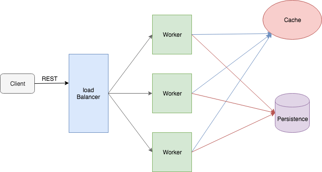
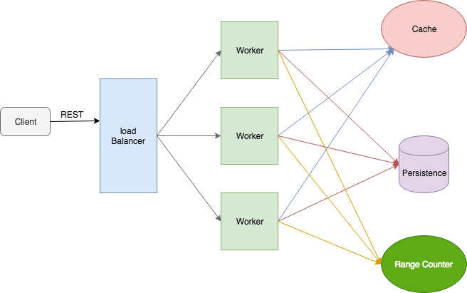

**URL Shortener**{: .firstword} aka **TinyURL**{: .firstword} is a very common problem of system design in interview questions. Let's begin by defining the

## Problem Statement of URL Shortener (TinyURL )
Design a tiny URL service with following requirements.
- It should generate a **unique** tiny URL for longURL
- It should be Scalability

## Proposed Solution of URL Shortener (TinyURL)
Let's try to solve this problem by building a Webservice exposing RESTFul endpoints. This service is responsible for generating tinyURL for longURL and returning tinyURL in response. Behind the scene, it uses a Database to store ```tinyURL -> longURL``` mapping.

<br/>

We can divide our system into following two major components, viz

<br/>

**Application Layer**{: .heading1}  
This component consists of Worker hosts (W) behind a `Loadbalancer` running web service exposing following RESTFul API to Client,

<br/>

**POST url/{longURL}**{: .heading2}
- This API creates a tinyURL for `longURL` 
- Stores both URL in persistence layer (Caching + DB) 
- Returns tinyURL in response

<br/>

**GET url/{tinyURL}**{: .heading2}
- This API returns long URL for the `tinyURL` present in URI
- It first searches in Cache, If now found goes to DB to fetch the data

<br/>

**Persistent Layer**{: .heading1}  
This is the Database layer which persists the mapping of TinyURL and LongURL. Database Schema can have columns of TinyURL, LongURL and a unique identifier.

<br/>

We have also used a catching layer (Memcache or Redis) to improve the response time.

<br/>


{:title="URL Shortener aka TinyURL System Design"}


<br/>

That's a decent Architecture, but the crux of this problem is

## How to generate Tiny URL
Suppose a tinyURL is 7 characters long and each character can be taken from following 62 alphabets
- a-z = 26
- A-Z = 26
- 0-9 = 10

<br/>

We can generate 62^7 ( ~= 3.5 trillion) tinyURLs from 62 alphabets having 7 characters length. Also, if we are generating 1000 tiny URLs/sec, it will take 110 years to exhaust this combination which is a decent time to provide the service.

<br/>

On a side note, a number from 0 to 3.5 trillion can be represented by 43 bits. Steps to convert 43 bits to tinyURL are as follows,
- Convert binary 43 bits into decimal. Suppose decimal number is 1,324,231
- Convert 1,324,231 (decimal number) into base 62. Suppose that number is 60,25,27
- Map above numbers to characters, e.g. (a-z => 0-25) (A-Z => 26-51) (0-9 => 52-61). 
- `1,324,231` will map to `8zB`

<br/>

Moving on, Let's look into

## Techniques to store Tiny URL

**Technique 1**{: .heading1}
- Generate a tinyURL from longURL
- Checks, whether generated `tinyURL`, is present in DB
- If tinyURL isn't present in DB then put longURL and tinyURL in DB

<br/>

**Problems:**{: .exception}
1. This technique creates race condition because it's possible that two threads may be simultaneously adding the same data to DB and may end up corrupting data.
2. This technique creates two tinyURLs for duplicate longURL

<br/>

**Solution to Problem 1**{: .heading2}  
Add (tinyURL, longURL) combination in database only when there is no key whose value is equal to tinyURL i.e. putIfAbsent(tinyURL, longURL). This approach requires support from DB (May or may not present in NoSQLDB)
  
<br/>

**Solution to Problem 2**{: .heading2}   
We calculate **MD5** of longURL and take first 43 bits to generate tinyURL. MD5 of longURL will be same for duplicate URLs. Hence first 43 bits of duplicate URLs will be the same generating common tinyURL.

<br/>

`putIfAbsent` feature (discussed as a solution to Problem 1) can be hard to find in a Database. So let's look into an alternate technique to prevent the race condition.  

<br/>

**Technique 2: Counter based approach**{: .heading1}  
In this approach, we use a unique number to generate tinyURL. This unique number is fetched from a single independent service as a counter variable which is incremented each time a unique number is requested. 

<br/>

When a worker node receives a request to create tinyURL, it fetches a unique number from counter service and uses it to generate tinyURL. As different hosts have a different unique number, they will generate different tinyURLs avoiding the race condition.

<br/>

**Problem:**{: .exception} This approach creates single point of failure/bottleneck.

<br/>

**Solution 1: Every host maintaining the counter**{: .heading2}  
Suppose there are 64 worker hosts and we know that we need 43 bits for a unique tinyURL. 

<br/>

We can calculate 43 bits as follows
- As we need 6 bits to uniquely identify a server node from a cluster of 64 worker host. Let's use those 6 bits to form tinyURL
- We can use 32 bits of the current timestamp
- Remaining 5 bits can be chosen at random/incremental values

<br/>

This solution has its problems, viz
1. Collision probability is high. Suppose we have 20 RPS on each host randomly generated last 5 bits will lead to high collision rate and if TPS > 32 (5 bits can represent decimal from range 0-31) we will surely have collisions
2. Adding new hosts will be problematic (6 bits representation will not work)

<br/>

**Solution 2: Range based approach**{: .heading2}  
In this approach, we take 1st billion combinations from 3.5 trillion combination and divide the 1st billion into 1000 ranges of 1 million each which is maintained by Zookeeper
- 1 -> 1,000,000 (range 1)
- 1,000,000 -> 2,000,000 (range 1)
- .... (range n)
- 999,000,000 -> 1,000,000,000 ((range 1000))

<br/>

Worker thread will come to Zookeeper and ask for an available range. Suppose W1 is assigned range 1, W1 will keep incrementing the counter and generate the unique number and generate tinyURL based on that

<br/>

When a worker thread exhausts their range, they will come to Zookeeper and take a new range. When 1st billion is exhausted, we will take 2nd billion and generate ranges to work with.

<br/>

This approach has the following benefits
- Guaranteed **No Collision**
- Addition of new worker threads is easy

<br/>

Challenges with this approach as follows
- If a worker dies, we will lose a million combinations, but that's not severe as we have 3.5 trillion combinations.
- We are generating different tinyURL for a duplicate longURL
- Sequentially generating URL can be a *Sequential Threat*.
  - To mitigate that we add random bits at the end of 43 bits (which will increase the length of tinyURL)

<br/>

** High-Level Architecture of Range based approach**  
**POST url/{longURL}**{: .heading2}  
- Create `tinyURL` request comes to worker thread through the load balancer
- Worker host checks whether its range based counter is exhausted or not
  - If exhausted, it will take a fresh range from Zookeeper
- Worker thread uses the counter to generate tinyURL
- TinyURL and longURL in then persisted to `Database` and in `Distributed Cache`.
  - We have placed tinyURL in cache because initially tinyURL will be accessed a lot.

<br/>

**GET url/{tinyURL}**{: .heading2}
- Get Request comes to worker thread through the load balancer
- Worker thread first checks the cache. 
  - For Cache Miss, it returns data from DB.
  - For Cache Hit, it returns longURL

<br/>

**Flow Diagram**  

<br/>

{:title="URL Shortener aka TinyURL System Design with cache and Range Counter"}

## References
- [System Design : Design a service like TinyUrl](https://www.youtube.com/watch?v=fMZMm_0ZhK4){:target="_blank" rel="nofollow noopener"}
