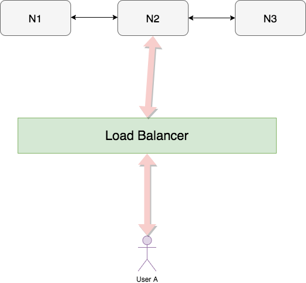
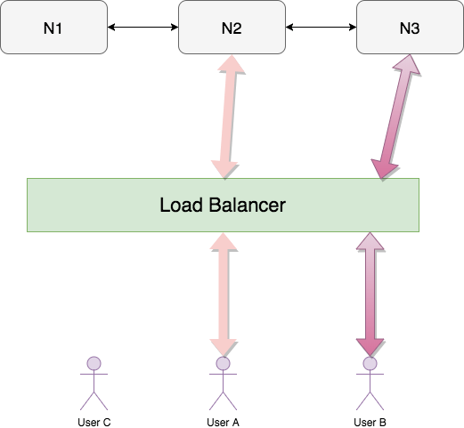
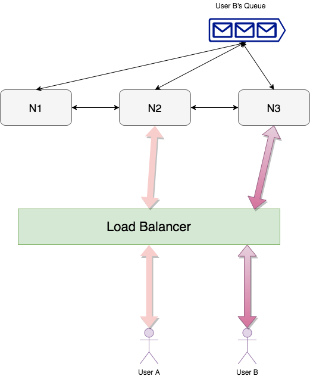
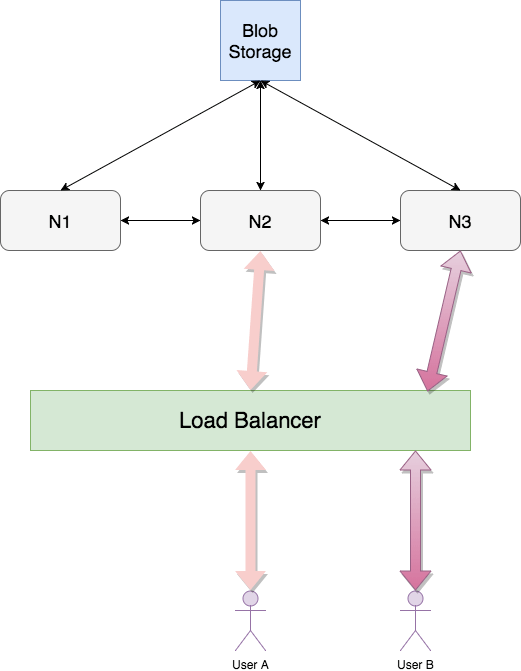

## Messaging Application Feature Requirements 
- Messaging Application should have one to one Chatting
- Messaging Application should show online user
- Messaging Application should show Send / Read message status
- Messaging Application should exchange picture/files etc

## Messaging Application Comminucation Protocol
For data exchange, we may look into following protocols:
- **HTTP**: We can't use HTTP protocol because in HTTP server can't initiate a request to the client.
- **Web Socket**: It is fully bidirectional connection i.e once user A is connected to server both user A and server can initiate the request. Also, it has *Sticky Session*, i.e. If user A is connected to Server1, then all subsequent requests from user A will be handled by Server1 only.
- **BOSH** (Bidirectional Streams Over Synchronous HTTP): In this protocol server holds on to request (of the client) till he has some new data. Once the server has new data, it will respond back. Once the client receives a response it will instantly initiate another request to the server.
- **Long Poll HTTP**: Client sends HTTP request to the server asking for new data, If the server has new data it responds with it else he responds with no new data. The client will wait for certain interval of time before initiating a new request.

## Data exchange between servers
{:title="Data exchange between servers"}

 

Once we are authenticated in our messaging application,
- User A sends a reqeust to Load Balancer. 
- Load balancer will pick one of the backend server (based on FIFO, No. of connections, load average etc). Suppose N2 is picked.
- User A and N2 are heart beating (when A is not sending any data). This heart beating info is stored in redis in below format

| User   | Server | Heartbeat Time           |
|--------|--------|--------------------------|
| User A | N2     | 2018-07-16T19:20:30+01:0 |

- If N2 dies, the connection will instantly break and User A will initiate a fresh connection. Suppose this time N3 is picked, table in Redis will be updated as follows

| User   | Server | Heartbeat Time           |
|--------|--------|--------------------------|
| User A | N2     | 2018-07-16T19:20:30+01:0 |
| User A | N3     | 2018-07-16T19:21:30+01:0 |

- If user A dies/inactive (basically heart beat stops), Redis will not be updated. Hence other users will see this info from redis to figure out when was user A online last time.
  
## Architecture 
{:title="Message Exchange between A and B"}

 
 
User A logs in, pulls its friends from **User Table**, which stores friendship between users (identified by uniquely generated ConversationID) along with their respective encryption keys (which will be encrypted with another master key stored somewhere else)    

| User 1 | User 2 | ConversationID | Encryption Key |
|--------|--------|----------------|----------------|
| User A | User B | 5              | ABfsf23er3r    |
| User A | User C | 6              | ABjhgj2hr3g    |

### When both users are online
*User A sends message to User B*  
Redis table has recent heartbeat entries indicating both are online

| User   | Server | Heartbeat Time           |
|--------|--------|--------------------------|
| User A | N2     | 2018-07-16T11:20:30+01:0 |
| User B | N3     | 2018-07-16T11:21:30+01:0 |

- User A first encrypts the message (with user B's encryption key) on the device itself and send to N2
- N2 receives User A's message + conversation ID (targeted to User B)
- N2 will persist this info in **Conversation Table** which looks like this
  
| Conversation_ID | Time                    | Text | FromUser | URL |
|-----------------|-------------------------|------|----------|-----|
|       5         | t1 (Uniquely generated) | {hi} | User A   |     |

- N2 confirms User A that message is sent (as entry is successfully made in DB)
- N2 Checks in redis whether user B is online and who's managing user B, which in our case is N3.
- N2 will send the message to N3, indicating that this message is to be send to user B.
- N3 will send the message to User B (who has the decryption key to read the message) 

### Message sent to offline user
*User A sends message to User C*  
Redis table doesn't have a recent heartbeat entry for user C indicating it is offline

| User   | Server | Heartbeat Time           |
|--------|--------|--------------------------|
| User A | N2     | 2018-07-16T11:20:30+01:0 |
| User C | N3     | 2018-07-16T09:21:30+01:0 |

- User A first encrypts the message (with user C's encryption key) on the device itself and send to N2
- N2 receives User A's message + conversation ID (targeted to User C)
- N2 will persist this info in **Conversation Table** which looks like this
  
| Conversation_ID | Time                    | Text | FromUser | URL |
|-----------------|-------------------------|------|----------|-----|
|        6        | t2 (Uniquely generated) | {YO} | User A   |     |

- N2 confirms User A that message is sent (as entry is successfully made in DB)
- N2 Checks in redis whether user C is an online and who's managing user C, as User C is offline. N2 will save message in **Unread Table**

| toUser | fromUser | time                                 |
|--------|----------|--------------------------------------|
| User C | User A   | t1 (time of earliest unread message) |

- Supposer User C comes online and starts heart beating with N1, N1 will update Redis and fetches all info from User Table (encryption key etc) and return it to User C
- N1 will check Unread messages for User C in Unread Table. It will find an entry for a message from User A and based on conversation ID between them it will pick the message from Conversation table and send it to User C
- User C will notify N1 that it has received the message.
- N1 will check for status of User A in Redis. 
  - Finding it online and managed by N2, N1 will tell N2 to update User A that its message is delivered. Post that the entry is removed from Unread Table
  - If User A is offline N1 will put the entry in **Read Table** with a timestamp of when that message was read. So that when User A comes online, N2 will read into Read table and update User A that User C has read that message
  
**READ TABLE**

| fromUser | toUser | time  |
|----------|--------|-------|
| User A   | User C | t1    |

## Architecture II
In this method system stores messages (if required) till the message is delivered to the recipient. We have a **Conversation Queue** in place of Conversation Table.

{:title="Message Exchange between A and B"}

### Message Transfer
- User A sends message to User B
- N2 (who is managing User A) receives User A’s message + conversation ID (targeted to User B)
- N2 acknowledges User A that message is received (sent status arrives)
- N2 Checks in redis whether user B is online and who’s managing user B, which in our case is N3.

*If User B is online*
- N2 will send the message to N3 (as User B is managed by N3), indicating that this message is to be send to user B.
- N3 will deliver the message to User B and acknowledge N2
- N2 will Notify User A message is delivered

 *If User B is offline*
- N2 will pile up messages in **Conversation Queue** of User B (uniquely created based on Conversation ID) and add an entry in **Unread Table**
- When User B comes online, N3 (who is managing User B) will check Unread messages in Unread Table. It will find an entry for a message from User A and based on Conversation ID between them it will pick the message from Conversation Queue and send it to User B and Acknowledge N2
- N2 will delete the message in Queue and Notify User A message is delivered

### READ STATUS
- When User B clicks to open User A's messages, an event is generated by User B's device targeted to User A indicating **Read Status**
- This event can be again queued in **Delivery Queue** if User A is offline

## Multimedia Exchange
{:title="Multimedia Exchange between A and B"}

 

- User A will encrypt the picture and send it to N2
- N2 will persist that picture in blob storage and get an URL back
- N2 will then update the conversation table
  
| Conversation_ID | Time                    | Text | FromUser | URL |
|-----------------|-------------------------|------|----------|-----|
|        5        | t4 (Uniquely generated) |      | User A   |url1 |

- N2 Checks in redis whether user B is online and who's managing user B, which in our case is N3.
- N2 will send the Url1 + thumbnail of the picture to N3, indicating that this message is to be send to user B.
- N3 will send Url1 + thumbnail of the picture to User B
- User B can download the picture from the blob store using that url and can decrypt the picture using decryption key

## How to optimise Database
**Conversation Table**

| Conversation_ID | Time                    | Text | FromUser | URL |
|-----------------|-------------------------|------|----------|-----|
|       5         | t1 (Uniquely generated) | {hi} | User A   |     |
|       5         | t2 (Uniquely generated) | {YO} | User A   |     |
|       5         | t3 (Uniquely generated) |{sSP} | User A   |     |
|       5         | t4 (Uniquely generated) |{wru?}| User A   |     |

Once messages are inserted in Conversation Table we don't update them and hence table keeps on growing. To optimise the storage we can take last few days worth of data, convert it into a blob  and store it into Blob storage (Which is way more cost efficient) instead of table. Suppose in our current table, we will store data of t1, t2, t3 in the blob and replace it with Url

| Conversation_ID | Time                    | Text | FromUser | URL |
|-----------------|-------------------------|------|----------|-----|
|       5         | t1 (Uniquely generated) |      | User A   |url1 |
|       5         | t4 (Uniquely generated) |{wru?}| User A   |     |

## Group Chat
- We can have a **Group Table** just like User Table, which shows a group membership and Conversation ID
- Conversation ID will then be saved in Conversation table and all the above discussed scenarios will apply

## References
- [System Design : Design messaging/chat service like Facebook Messenger or Whatsapp](https://www.youtube.com/watch?v=zKPNUMkwOJE){:target="_blank" rel="nofollow noopener"}  
- [System Design: Messenger service like Whatsapp or WeChat - Interview Question](https://www.youtube.com/watch?v=5m0L0k8ZtEs){:target="_blank" rel="nofollow noopener"}
