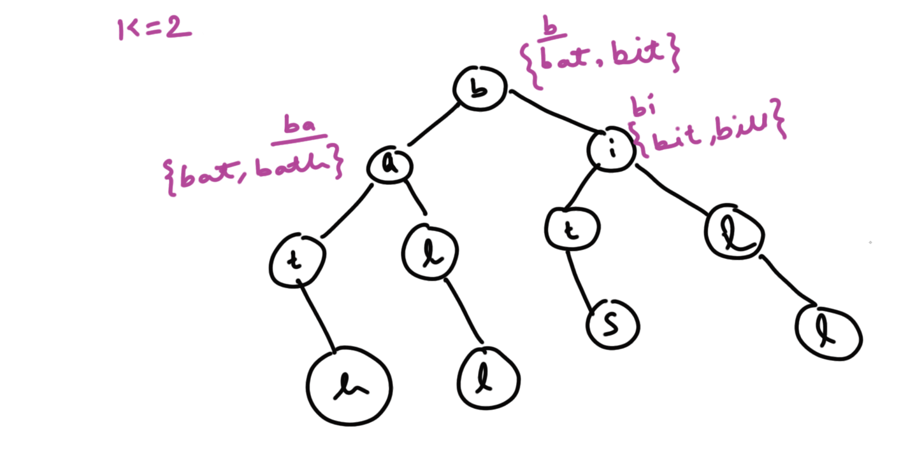
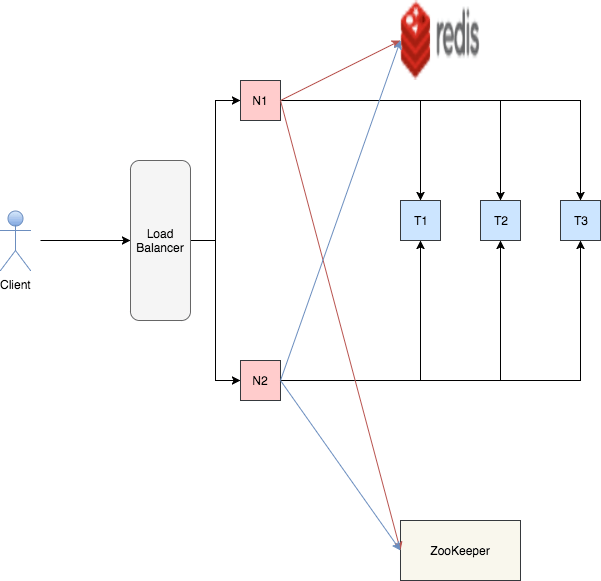

## Auto Complete or Type Ahead System Requirements
- Auto Complete search should provide top K results for a prefix
- Search results should be dynamic (based on Top News/Search Trends etc)
- Auto Complete system should be Scalable and Availabile
- Auto Complete system should have low Latency

## Auto Complete or Type Ahead High Level Design
The system can be broadly classified into two flows:

### Request Flow
- We will use Trie to hold our data
- Each Trie node will have top K terms for that prefix. For example in below diagram, for K = 2 we have for node b -> {bat, bit}, for ba -> {bat, bath} etc
{:title="Trie storing top 2 terms for that prefix"}
- On receiving the request we will look for that prefix into Trie and return results (i.e. top K elements) to be displayed as Auto Complete
- **API**: ``` List<Autocomplete> get(String Prefix) ```
  - On receiving the request, e.g. for prefix 'b', we can quickly return {bat, bit}

### Data Collection Flow
- Data collection flow will decide top K terms for that prefix based on their weight
- A list of strings with weights will be streaming in from a background process, we need to aggregate them and apply them into trie. Providing dynamic nature to auto complete

## Auto Complete or Type Ahead Low Level Design
### Request Flow

{:title="Autocomplete system Design"}

- T1, T2, T3 represent trie in 3 different server nodes, holding replica of single trie (multiple nodes for availability)
- Zookeeper Entry: ``` {a-$ -> T1, T2, T3}  ``` i.e. Entire data is present in T1, T2, T3
- Load Balancer will delegate request to either application Servers (N1 or N2, which we can scale as per traffic requirements)
- Lets say a request with prefix (ba) is routed to N1
- N1 will first look into the distributed cache (e.g. Redis) to fetch data for {ba}. As its first request it will be a cache miss
- N1 will consult with Zookeeper to know who is responsible for {ba}
- Zookeeper will return T1, T2, T3
- N1 will randomly pick the node (suppose it picks T2) and fetches the data from it which is {bat, bath}
- N1 will store this data into distributed cache

### Scaling
Let's say with time our data grows and it can't be fit in one trie node. So we will split the data into multiple nodes and Zookeeper entry will look like:
- ``` a - ba -> T1, T2, T3 ```
- ``` ba - k -> T7, T8, T9 ```
- ``` k- $ -> T4, T5, T6 ```
 
### Data Collection Flow
**API**{: .heading1} ``` data(phrase, weight) ```  

<br/>

**Aggregator**{: .heading1}: It will aggregate the data for a period of time (e.g. 2m) and then flush data into the DB.  

<br/>

**DB Schema**{: .heading1}  

| Phrase |    Time    | Sum of Weights |
|--------|------------|----------------|
| bat    | 1 Oct      | 434343         |
| bat    | 2 Oct      | 7546534        |
| bat    | 3 Oct      | 643264         |
| bat    | 4 Oct 1:00 | 765            |
| bat    | 4 Oct 2:00 | 868            |

- We collect hourly data and flush it into the table
- While aggregating trending data we give more weight to current data  

<br/>

**Data Optimization**{: .heading1}
  - We can aggregate the hourly data of the entire day and create a daily data entry
  - Discard data after a certain number of days if it's not important
  - If the sum of particular phrase is less that a particular number we can get rid of that phrase cause we are sure that , that particular phrase will not come in our auto complete result

<br/>

**Appliers**{: .heading1}
  - They will take data from DB at any particular interval (e.g. 1h) and apply them to Trie
  - As we have 3 divisions in Zookeeper, we will have 3 appliers working on respective range e.g.
    - A1 -> a - ba
    - A2 -> ba - k
    - A3 -> k- $
  - *Working*: 
    - A1 will take all phrases from a - bc
    - Apply the weight data using Data Table
    - Build the trie internally where every node will have top K terms for that node
    - Dump the data into T1, T2, T3

## References
- [System design : Design Autocomplete or Typeahead Suggestions for Google search](https://www.youtube.com/watch?v=us0qySiUsGU){:target="_blank" rel="nofollow noopener"}
