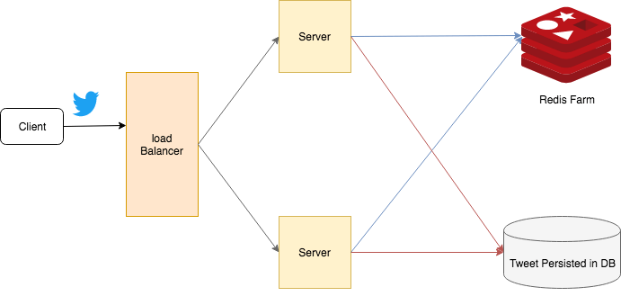

## What we will build as a MVP of Twitter? 
- User should be able to tweet
- We should display Tweet Timeline(s), viz
  - **User timeline**{: .heading1}: Displaying user's tweets and tweets user retweet
  - **Home timeline**{: .heading1}: Displaying Tweets from people user follow
- User should be able to follow another user

## System Characteristics
- Faster Reads as Twitter is a read heavy
- Eventual consistency (data served by all servers will be consistent eventually) is bearable. Its not much of a pain if user sees tweet of his follower a bit delayed 
- Space is not a problem as tweets are limited to 140 characters

## Architecture
Basic Architecture of Twitter service consists of a **User Table**, **Tweet Table** and **Followers Table**
- User Information is stored in *User Table*
- When a user tweets it gets stored in *Tweet Table* along with User ID.
  - User Table will have 1 to many relationships with Tweet Table
- When a user follows another user, it gets stored in *Followers Table*

### Building User Timeline
- Fetch all the entries from Global Tweet Table for a particular user
- Display it on user timeline  

### Building Home Timeline
- Fetch all the users whom this user is following (from followers table) 
- Fetch tweets from global tweet table for all
- Display it on home timeline 
- **Drawback**: This huge search operation on relational DB is NOT Scalable. Though we can use sharding etc but this huge search operation will take time once tweet table grows to millions.

### Optimization for Home Timeline
We can optimize home timeline by precomputing all the home timelines and storing it in-memory (e.g. Redis). A simple flow of tweet looks like,
- User A Tweeted
- Through Load Balancer tweet will flow into back end servers
- Server node will save tweet in DB
- Server node will fetch all the users that follows User A
- Server node will inject this tweet into in memory timelines of his followers 
  - Eventually all followers of User A will see tweet of User A in their timeline

{:title="Twitter Architecture"}

## System Optimizations as User grows
- **Compute Optimizations**{: .heading1}: For inactive user (e.g. for two weeks or something) don't update his timeline. Which makes its first visit to home timeline a little longer
- **Data Structure**{: .heading1}: 
  - Native Redis lists
  - Each node of list will have tweet ID and Sender of tweet
- **Scaling Redis Cluster**{: .heading1}
  - We can use Zookeeper to shard Redis cluster as per user IDs and then delegate the precompute request accordingly
- **Availability**{: .heading1} can be achieved by replicating Redis nodes

### Optimization for Celebrity Followers
If a person with 1 million followers on Twitter tweet, We need to update one million lists which is not very scalable. What we can do is,
- Precomputed home timeline of User A with everyone except celebrity tweet(s)
- When User A access his timeline his tweet feed is merged with celebrity tweet at load time.

## References
- [System Design: How to design Twitter? Interview question at Facebook, Google, Microsoft](https://www.youtube.com/watch?v=KmAyPUv9gOY){:target="_blank" rel="nofollow noopener"}  
- [How to answer design question: How do you design a twitter?](https://www.youtube.com/watch?v=gX8S7b8UYl8){:target="_blank" rel="nofollow noopener"}
