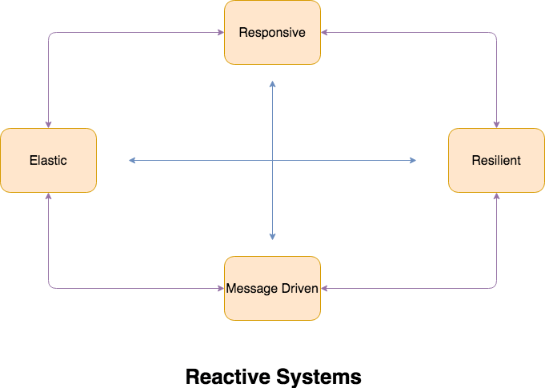

**Reactive**{: .firstword} is an overloaded word in software development industry. We may often hear this buzzword associated with,
- Reactive Systems
- Reactive Programming
- Functional Reactive Programming
- Reactive Design
- Reactive Architecture Patterns
- Reactive application

and may be much more ...

 

I would argue every topic requires an article for itself and I would like to primarily focus on *Reactive Systems* in this article. 

 

Before proceeding forward I would like to bring us all on same page by defining few terms that I will frequently use in this article. Beginning with,

### System
> A system provides set of services to its clients/Users

 

For example, a website allowing us to book a Hotel is a System in itself. Keeping it simple, lets say it provides its users/clients with following services
- Making a reservation in the hotel of their choice
- Cancellation

A system is then further divided into *Components*. So let's define

### Component
> Components of a System collaborate with each other to provide services.

 

Continuing with the example of *Booking System*, **Making a reservation** is one service which require following components to talk to each other
- *Front End*: Website loaded in the browser
- *User management*: Maitaining profile of user
- *Payment*: Which charges the Credit/Debit Card
- *Notification*: Informing customer and user

... and much more **you got the idea.**

 

Interaction between these components can be simple client-server Or queue based and so on. 

 

We can optinally group few components and call them **Sub Systems**.

 

You know the drill.

 

Moving on lets begin by answering a simple question,

## What are Reactive Systems?
I personally like the Reactive Systems definition on Oreilly blog, which says
> A reactive system is an architectural style that allows multiple individual applications to coalesce as a single unit, reacting to its surroundings, while remaining aware of each other.

 

If above definition looks too abstract, lets try again
> Reactive Systems in a nutshell is an Architectural and Design pattern of building large scale, responsive, resilient, self healing systems where individual components talk to each other over Asynchronous Messaging.

 

I guess above definition packs too many "buzzword". Trust me I will add details. :)

 

First lets focus on 

## Why Reactive System
As rightly mentioned in [Reactive manifesto](https://www.reactivemanifesto.org/){:target="_blank" rel="nofollow noopener"},
> Today's demands are simply not met by yesterday’s software architectures

 

Applications developed today requires to have
- Faster release cycle to ship new functionality quickly
- Milliseconds response time
- Cloud based clusters
- 100% uptime
- Tolerant to failure 

and much more depending on the use cases.

 

Even the underlying hardware has evolved to multi-core processors generating compute capacity to handle data in petabytes.

 

The requirements mentioned above are more or less common in every organisation trying to solve a problem through technology.

 

Even though the problems may be completely different but the guidelines and design principles that we choose to solve it, does overlap.

 

**Shall we benefit from those already tested Solutions?**

 

Definitely, *Yes !!*

 

Like-minded people have already identified common patters in those problems and drafted guidelines which may act as blue print for next generation application.

 

One such attempt is [Reactive Manifesto](https://www.reactivemanifesto.org/){:target="_blank" rel="nofollow noopener"}, which believes
> All necessary aspects are already recognised individually

 

Basically it says, 
> Systems should be Responsive, Resilient, Elastic and Message Driven. 

They call such systems as **Reactive Systems**.

 

{:title="Reactive Systems"}

 

So without further ado, lets drill into the

## Characteristics of Reactive System

### Responsiveness
Responsiveness means that Reactive Systems
- Should respond in *consistent and timely manner.* 
  - when an API call is made we expect a predictable and consistent response within SLAs. It helps in setting a reliable upper bound paving way for effective error handling and building confidence for its clients.
- Will detect problems quickly and mitigate it effectively.
  - It demonstrates the self healing nature of reactive systems in which once bleeding begins, it is detected quickly and system takes appropriate actions to mitigate it.

### Resilient
> Resilience means that Reactive Systems should be responsive in face of failure.

i.e. Failure(s) in one component should neither burden its client for handling the failures nor should bring the entire system to a grinding halt.

 

Resilience is achieved by 
- *Replication:* To ensure high availability we use replication. e.g. replicating master nodes of Redis Cluster.
- *Containment:* Failures are contained within each component. e.g. Failures in component responsible for lets say Async Notification should not bring down Sync Notification.
- *Isolation:* Components of a system are isolated ensuring part of system can fail and recover without compromising the entire system.
- *Delegation:* Recovery of each component is delegated to another component (maybe external). e.g. falling back to alternate data source if primary data source is unavailable

### Elastic
> Elasticity means that Reactive Systems should be responsive under varying workload.

 

Reactive Systems react to changes in the input rate by increasing or decreasing the resources allocated to service these inputs. Best example to understand this situation is cluster of similar services behind a load balancer. When load increases additional nodes are added via predictive or reactive scaling algorithm and vice versa.

 

Management of resources under varying workload is a very powerful concept  
- Ensuring we have no contention points or central bottlenecks
- Enabling us to shard or replicate components and distribute inputs among them

 

**Note:** Elasticity is achieved in cost-effective way on commodity hardware and software platforms.

### Message Driven
> Reactive systems have *Asynchronous Messaging* i.e. while requesting data we don’t wait for response, instead we register a callback and return. When data is available, it is pushed to callback method.

 

*Asynchronous Messaging* establishes a boundary between components which further helps in ensuring 
- **Loose coupling and Isolation**{: .heading1} implying sender and receiver can have independent life-cycles. They do not need to be present at the same time and run on same process for communication to be possible. For example, queue based systems in which sender is pushing into queue and reciever is pulling from the queue.
- **Elasticity**{: .heading1} implying throughput of a system scales up or down automatically to meet varying demand.
- **Location transparency**{: .heading1} (also known as Decoupling in space) implying we are not dependent on server A talking to server B instead a cluster of micro service 'A'talks to cluster of micro service 'B'.
- **Load Management**{: .heading1} implying sender and receiver can scale independently. For example, if the rate by which sender is pushing messages in the queue increases then reciever can scale independently to consume and process messages from the queue.

 

**Note**{: .heading2}
- Boundary between components ensures failures are notified in form of messages.
- Non-blocking communication facilitates only consume resources while active, leading to less system overhead.

## Conclusion
I would like to conclude it by suggesting the readers to look into/apply the characteristics discussed above, next time they are building New System. You may also look into the case study of [How Paypal is handling billions of requests per day on 8 VMs and 2 vCPU?](https://www.paypal-engineering.com/2016/05/11/squbs-a-new-reactive-way-for-paypal-to-build-applications/){:target="_blank" rel="nofollow noopener"} by building Reactive Systems on Akka and Squbs.

 

See everything boils down to the satisfaction of your customer/client when they visit your site. If site is slow, unresponsive and in worse case down, then that's **terrible experience**{: .exception}.

**Take all steps to avoid it**

## Reference
- [Reactive manifesto](https://www.reactivemanifesto.org/){:target="_blank" rel="nofollow noopener"}
- [Reactive manifesto glossary](https://www.reactivemanifesto.org/glossary){:target="_blank" rel="nofollow noopener"}
- [Tech Primers - What is Reactive Programming?](https://www.youtube.com/watch?v=0ueFTvSdxpw){:target="_blank" rel="nofollow noopener"}
- [O Reilly https://www.oreilly.com/ideas/reactive-programming-vs-reactive-systems](https://www.oreilly.com/ideas/https://www.oreilly.com/ideas/reactive-programming-vs-reactive-systems){:target="_blank" rel="nofollow noopener"}